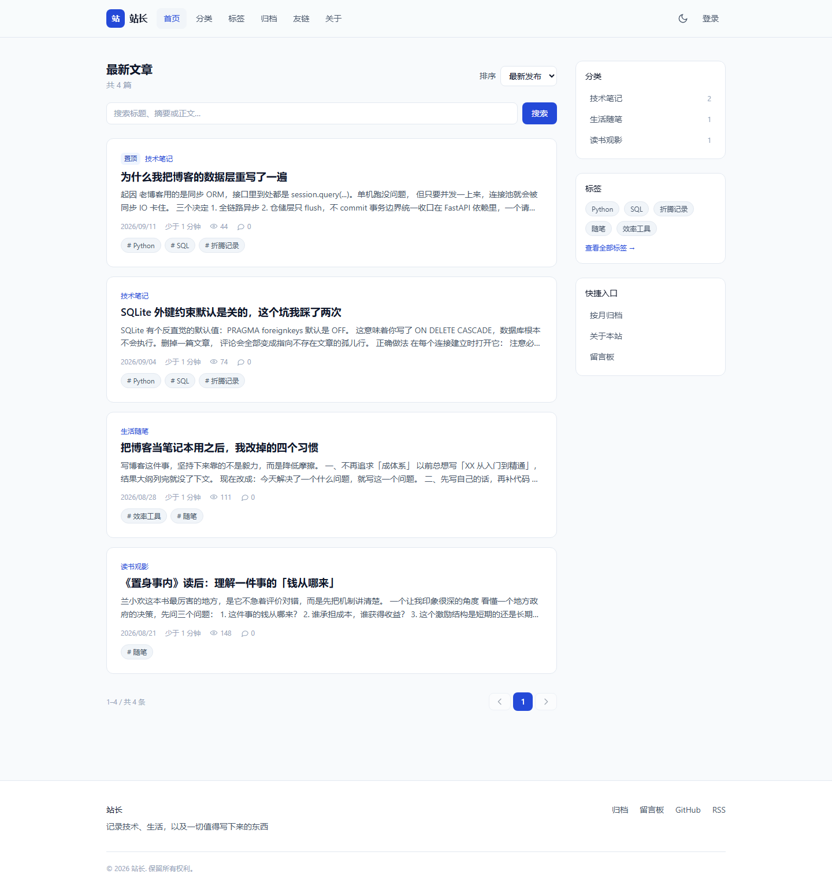
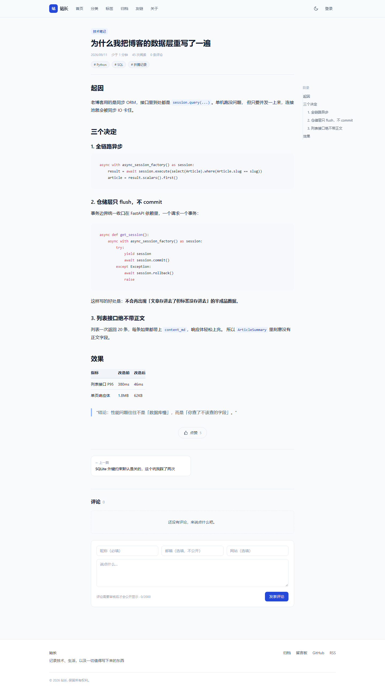
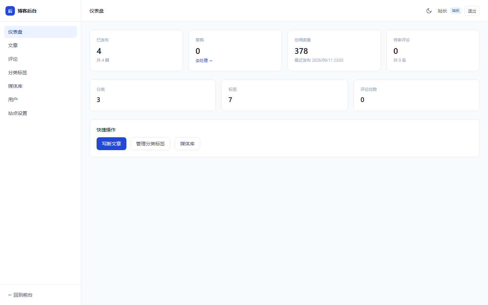
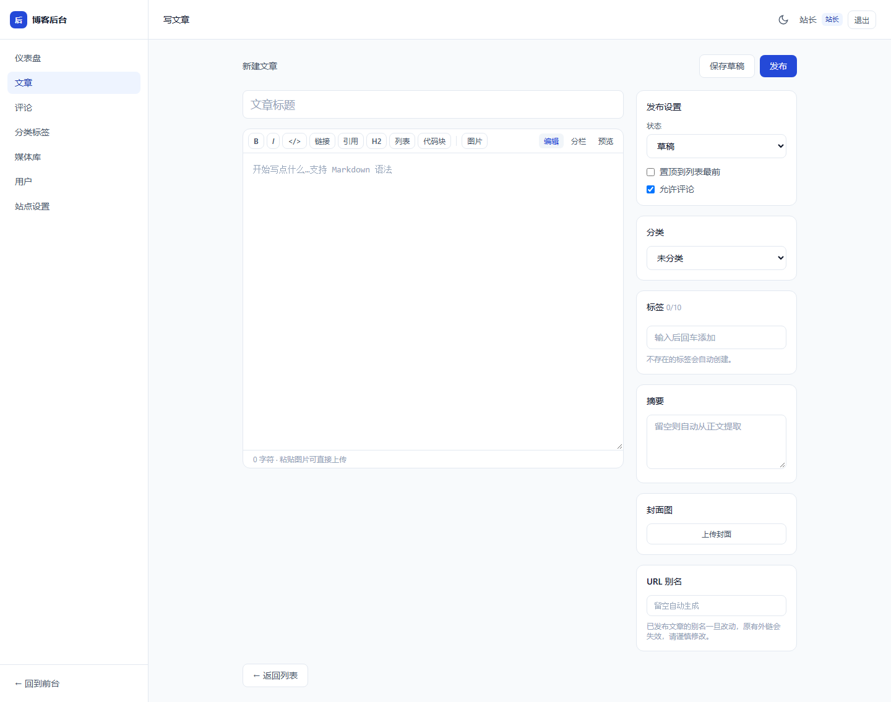
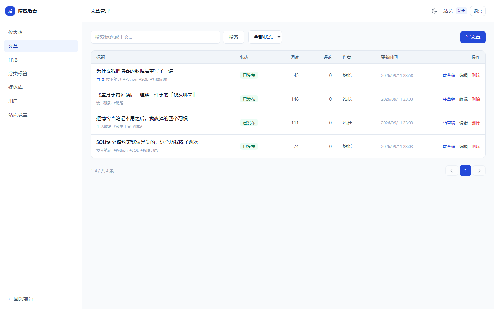
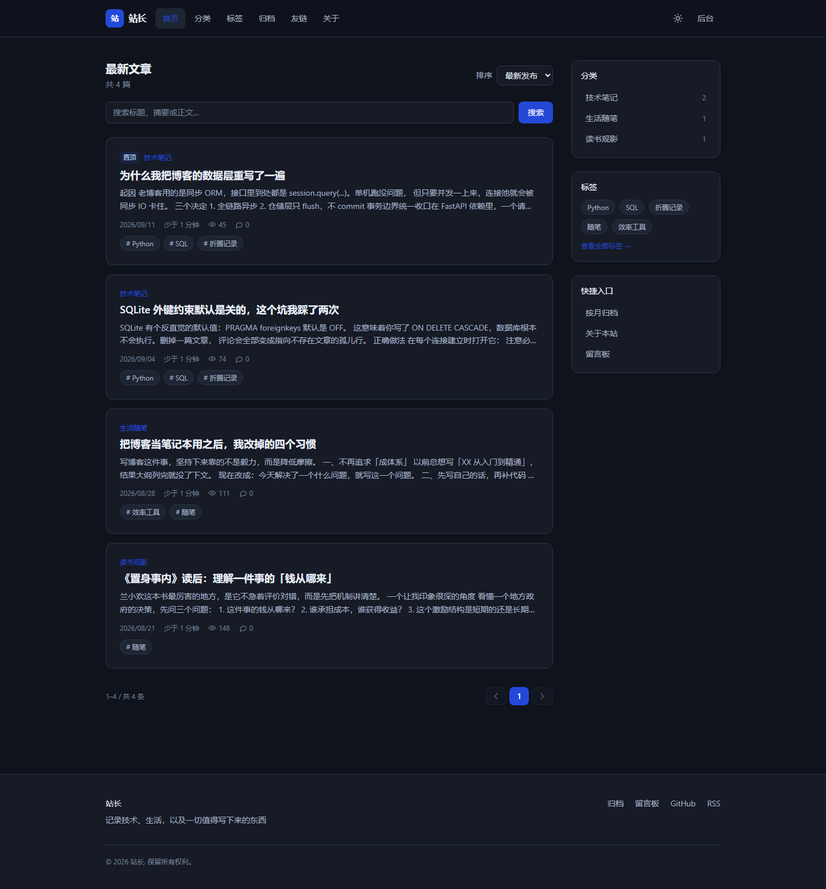

# 个人博客 · Personal Blog

> 一套可以直接上线的个人博客系统。技术笔记、生活随笔、读书观影都往这里放。

[](https://github.com/FurinaLuna/personal-blog/actions/workflows/ci.yml)
[](LICENSE)
[](https://www.python.org/)
[](https://nodejs.org/)
[](https://fastapi.tiangolo.com/)
[](https://vuejs.org/)

前后端分离架构：后端 FastAPI 全异步 + 分层设计，前端 Vue 3 + TypeScript。
**写出来能跑、改起来可验证** —— 533 个后端测试（SQLite 与 PostgreSQL 双方言各跑一遍）、
438 个前端单测，外加三个真实浏览器端到端脚本（冒烟 34 项 / 交互 22 项 / 全功能回归 41 项）
与两套数据库方言的真实链路端到端（SQLite 62 条 / PostgreSQL 61 条）。

---

## 目录

- [项目简介](#项目简介)
- [功能一览](#功能一览)
- [界面预览](#界面预览)
- [技术栈](#技术栈)
- [快速开始](#快速开始)
- [常用命令](#常用命令)
- [目录结构](#目录结构)
- [配置项](#配置项)
- [API 概览](#api-概览)
- [测试与验证](#测试与验证)
- [部署](#部署)
- [贡献指南](#贡献指南)
- [许可证](#许可证)

---

## 项目简介

一套自用的个人博客，两个目标：

1. **内容侧要好用** —— Markdown 写作、分类标签、草稿保护、评论审核、媒体库，
   后台该有的都有，不为了"简洁"牺牲功能。
2. **工程侧要可信** —— 分层清晰、类型完整、每个功能都有对应的测试或验证脚本。
   仓库里那些「只有真实浏览器才能发现」的坑（登录后被弹回登录页、
   后台布局嵌套导致子页面不渲染）都写进了文档，不是靠运气修好的。

默认 SQLite 零依赖启动，需要时一个环境变量切到 PostgreSQL。

## 功能一览

### 内容与前台

| 功能 | 说明 |
|---|---|
| 文章状态 | 草稿 / 已发布 / 已归档；支持置顶、封面图、阅读时长自动估算 |
| Markdown 渲染 | `marked → DOMPurify 白名单消毒 → 增强`（标题锚点、代码高亮、外链 `rel`、图片懒加载） |
| 代码块 | 按需注册 17 种语言（比 `lib/common` 省 60% 体积）、右上复制按钮、右下语言标签 |
| 阅读体验 | 自动目录（桌面侧栏 + 移动端浮动抽屉）、阅读进度条、相关文章推荐 |
| 组织方式 | 分类（一对一）、标签（多对多）、按月归档、关键词搜索 |
| 搜索 | **两种方言各有自己的加速路径**：SQLite 走 FTS5（trigram 分词 + bm25 + 高亮片段），PostgreSQL 走 `pg_trgm` + 3 条 GIN 索引；1–2 字的短查询两边都退回 LIKE 兜底（三元组索引的固有限制），端点单独限流 30/分 |
| 系列 / 合集 | 多篇文章编成一个系列；详情页显示系列导航（上下篇），前台有系列聚合页与系列详情页，后台可增删改；删除系列只解关联，文章保留 |
| 互动 | 两级评论（先审后发）、点赞、阅读量统计 |
| 列表页 | 服务端分页 + 五种排序 + 筛选，**全部状态存在 URL query**，刷新/分享/前进后退都能还原 |
| 主题 | 亮 / 暗 / 跟随系统三态，首屏无闪烁 |
| 订阅与分享 | RSS 2.0 与 sitemap，每页独立标题与 Open Graph 卡片 |

### 后台

- **文章编辑器**：分栏预览、工具栏、粘贴/拖拽上传图片、**本地草稿自动保存与恢复**
- **评论审核**：待审队列、逐条通过/撤下、删除
- **分类与标签**：增删改，附带文章计数
- **媒体库**：上传、预览、复制 Markdown 片段、删除
- **用户管理**：分配账号与角色（不开放自助注册）
- **站点设置**：站点信息、社交链接、关于页内容、评论开关
- **全局错误边界**：任一组件抛错渲染兜底页并提供重试，而不是整页白屏

### 后端与运维

- FastAPI + SQLAlchemy 2.0（全异步）+ Pydantic v2，严格分层
  （`api` / `services` / `repositories` / `models` / `schemas`）
- JWT 双 Token（access 120 分钟 / refresh 7 天），401 静默续期（带单飞锁防并发重复刷新）
- 三级角色：访客 / 作者 / 站长；三层防护：依赖注入门禁 → 资源归属校验 → Schema 层防提权
- 上传安全：Pillow 真实解码判型（不信任客户端声明的 `Content-Type`）、流式限流读、
  扩展名白名单（默认禁 SVG / HTML）、服务端生成文件名
- 请求 ID 透传 + 结构化 JSON 日志 + 限流（登录 5/分、评论 5/分、点赞 20/分、搜索 30/分）
- 评论邮件通知：有人回复你的评论时给被回复者发信（附签名退订链接），
  非站长发的新评论提醒站长（**待审也提醒**——那正是需要审核的时刻）；
  SMTP 默认关闭（仅配 `SMTP_ENABLED=true` 才发信），发信是评论接口提交后触发的后台任务，
  **失败只记日志，绝不影响评论接口返回**；退订幂等，重复点击与重复提交都返回成功
- `/health` 存活探针与 `/ready` 就绪探针（真实查库，未就绪返回 503）
- Alembic 迁移（升降级都验证过）；Docker + nginx + docker-compose

## 界面预览

| 首页 | 文章详情 |
|---|---|
|  |  |

| 后台仪表盘 | 文章编辑器 |
|---|---|
|  |  |

| 后台文章管理 | 暗色主题 |
|---|---|
|  |  |

## 技术栈

| 层 | 选型 | 为什么 |
|---|---|---|
| 后端框架 | FastAPI | 原生异步 + 依赖注入 + 自动 OpenAPI 文档 |
| ORM | SQLAlchemy 2.0（async） | 全链路异步，避免同步驱动拖住事件循环 |
| 校验 | Pydantic v2 | 请求/响应模型即文档，字段级错误可直接回填表单 |
| 数据库 | SQLite（默认）/ PostgreSQL | 开发零依赖，生产一行环境变量切换 |
| 迁移 | Alembic | 表结构变更可回滚，不靠手改生产库 |
| 认证 | PyJWT + bcrypt | 双 Token；密码只存哈希 |
| 前端框架 | Vue 3 + TypeScript | 组合式 API + 完整类型 |
| 构建 | Vite | 开发态秒级热更新；产物按路由与库分包 |
| 状态 | Pinia | 认证 / 站点档案 / 主题三个 store |
| 样式 | Tailwind CSS | 语义色变量集中定义，换肤只改一个文件 |
| Markdown | marked + DOMPurify + highlight.js | 渲染与消毒分离，消毒排在增强之前 |
| 测试 | pytest / Vitest | 后端 533 例（SQLite + PostgreSQL 双方言）、前端 438 例 |
| 端到端 | Chrome DevTools Protocol | 复用本机 Chrome，不引入 Playwright 的数百 MB 依赖 |

## 快速开始

**前置要求**：Python ≥ 3.11、Node ≥ 20。默认使用 SQLite，不需要额外装数据库。

```bash
git clone https://github.com/FurinaLuna/personal-blog.git
cd personal-blog
```

**1. 启动后端**

```bash
cd backend
python -m venv .venv
.venv/Scripts/activate          # Windows
# source .venv/bin/activate     # macOS / Linux
pip install -e ".[dev]"
cp .env.example .env
uvicorn app.main:app --reload --app-dir src --port 8000
```

**2. 启动前端**（另开一个终端）

```bash
cd frontend
npm install
npm run dev
```

| 入口 | 地址 |
|---|---|
| 前台 | <http://localhost:5173> |
| 后台 | <http://localhost:5173/admin> |
| API 文档 | <http://localhost:8000/docs> |
| 就绪检查 | <http://localhost:8000/ready> |

**默认管理员**：`admin` / `admin123456` —— **生产环境请立刻修改**。

首次启动会自动建表并写入 4 篇演示文章；不想要演示数据就把 `.env` 里的
`SEED_DEMO_DATA` 设为 `false`。

装了 `make` 的话，`make install` + `make dev` 可以一步到位。

## 常用命令

```bash
make help          # 列出全部命令
make install       # 安装前后端依赖
make dev           # 同时启动前后端
make check         # 提交前跑这个：ruff + 格式 + 后端测试 + 前端单测
make test-all      # 前后端测试
make build         # 前端类型检查 + 生产构建
make smoke         # 真实浏览器冒烟（34 项，需先 make dev）
make interaction   # 真实点击的交互验证（22 项，需先 make dev）
make full-check    # 全功能回归 + 数据基线核对（41 项，自清理，需先 make dev）
make migrate       # 应用数据库迁移
make migration m="add xxx field"   # 生成迁移
make docker-up     # 容器化启动
```

Windows 上没有 `make` 时，每个目标的原始命令都写在 `Makefile` 里。

## 目录结构

```
personal-blog/
├── backend/                        # FastAPI 后端
│   ├── src/app/
│   │   ├── main.py                 # 应用工厂：中间件 / 异常处理 / 探针
│   │   ├── config.py               # 配置（全部来自环境变量）
│   │   ├── api/                    # 路由、依赖注入、限流、请求上下文中间件
│   │   │   └── v1/                 # 按资源分组的端点
│   │   ├── models/                 # SQLAlchemy 模型（11 张表）
│   │   ├── schemas/                # Pydantic 请求/响应模型
│   │   ├── services/               # 业务规则唯一所在地
│   │   ├── repositories/           # 数据访问（只 flush，不 commit）
│   │   ├── db/                     # 会话 / 基类 / 自定义类型 / 种子数据
│   │   └── utils/                  # 安全 / 存储 / 日志 / 限流 / 异常
│   ├── tests/                      # 533 个 pytest 用例（SQLite / PostgreSQL 双方言）
│   ├── alembic/                    # 数据库迁移
│   ├── README.md                   # 后端说明（分层职责 / 迁移 / 运维端点）
│   └── storage/                    # 上传的图片与附件（内容不入库）
├── frontend/                       # Vue 3 前端
│   ├── src/
│   │   ├── api/                    # HTTP 客户端 + 各模块接口
│   │   ├── components/             # 可复用组件
│   │   ├── composables/            # useAsyncData / useAction / useHead / useDraftAutosave …
│   │   ├── layouts/                # Default / Admin / Blank 三套布局
│   │   ├── router/                 # 路由表 + 守卫
│   │   ├── stores/                 # Pinia：auth / site / theme
│   │   ├── styles/                 # ★ 样式：tokens / base / components / prose / vendor
│   │   ├── utils/                  # Markdown 渲染 / 格式化 / 预取 / 状态元数据
│   │   └── views/                  # 前台 9 页 + 后台 8 页（★ views 层暂无单测）
│   └── src/**/*.spec.ts            # 200 个 Vitest 用例（20 个 spec 文件）
├── deploy/                         # Dockerfile × 2 + nginx.conf
├── docs/
│   ├── DESIGN.md                   # ★ 完整设计与实现方案（五大模块）
│   ├── ASSESSMENT.md               # 全面评估（风险 / 升级 / 功能 / 性能）
│   ├── CODE-REVIEW.md              # 代码评审（臃肿 / 冗余 / 重复 / 内聚耦合）
│   ├── STYLEGUIDE.md               # ★ 样式规范（文件组织 / BEM 命名 / 验证方法）
│   ├── ROADMAP.md                  # 迭代路线图与进度
│   ├── MODULES.md                  # ★ 模块边界权威说明（职责 / 依赖方向 / 禁止事项 / 扩展点）
│   ├── OPTIMIZE-QUICK-WINS.md      # 前端优化「1-2 天见效」清单（改哪个文件、改什么、为什么）
│   ├── TEST-REPORT.md              # 2026-09-12 全功能回归报告（dev + 生产包两层环境 × E2E 脚本）
│   ├── devlog/                     # 逐日开发日志（决策 / 验证 / 踩坑）
│   ├── test-reports/               # full-check 各环境的运行报告（JSON）
│   └── screenshots/                # 界面截图
├── tools/
│   ├── e2e_live/
│   │   ├── e2e_run.py              # 真实环境端到端：临时空库 + alembic 建表 + 独立
│   │   │                           # uvicorn 进程，62/61 条用例（HTTP 断言 + 直连库复核）；
│   │   │                           # E2E_DB=postgres 切 PostgreSQL 方言（默认是 SQLite）
│   │   └── probe.py                # 定点复现某个 500 并抓取服务端堆栈
│   ├── smoke-check.mjs             # CDP 冒烟：逐页渲染与关键交互（34 项，只读）
│   ├── interaction-check.mjs       # CDP 交互：写操作与失败路径（22 项，对称还原）
│   ├── full-check.mjs              # CDP 全功能回归：写操作生命周期 + 数据基线核对（41 项，自清理）
│   ├── showcase-demo.mjs           # CDP 功能演示：用户视角完整旅程回放（11 步截图断言）
│   ├── style-baseline.mjs          # 采集关键元素的计算样式（样式重构前/后比对）
│   ├── style-diff.mjs              # 比对两份样式基线，有差异即报
│   └── style-ab-font.mjs           # 针对字体令牌修复的 A/B 验证
├── shots/                          # E2E 运行产物（验证脚本自动生成，已 gitignore）
├── Makefile                        # 常用命令入口
├── docker-compose.yml
├── CONTRIBUTING.md                 # 贡献指南
├── SECURITY.md                     # 安全策略与部署注意事项
├── CHANGELOG.md                    # 更新日志
└── LICENSE                         # MIT
```

## 配置项

全部通过环境变量注入。Docker 部署的模板是根目录
[`.env.example`](.env.example)，裸机开发的模板是
[`backend/.env.example`](backend/.env.example)（内容更全，含上传白名单、
限流、图片尺寸档位等）。
**开发环境大部分可保持默认**，生产必须改的项已在表中标出。

| 变量 | 默认值 | 说明 |
|---|---|---|
| `APP_ENV` | `development` | ⚠️ 生产设 `production`（会自动关闭 `/docs` 与 `/redoc`） |
| `DEBUG` | `true` | ⚠️ 生产设 `false` |
| `DATABASE_URL` | SQLite 文件 | 生产推荐 `postgresql+asyncpg://…` |
| `DB_AUTO_CREATE` | `true` | ⚠️ 生产设 `false`，改由 `alembic upgrade head` 管表结构 |
| `JWT_SECRET_KEY` | 开发占位值 | ⚠️ 生产必须换：`openssl rand -hex 32` |
| `ACCESS_TOKEN_EXPIRE_MINUTES` | `120` | access token 有效期 |
| `REFRESH_TOKEN_EXPIRE_DAYS` | `7` | refresh token 有效期 |
| `CORS_ORIGINS` | localhost | ⚠️ 生产只填真实前端域名，逗号分隔 |
| `SITE_BASE_URL` | `http://localhost:5173` | RSS / sitemap 里的绝对链接依赖它 |
| `STORAGE_DIR` | `./storage` | 上传文件根目录 |
| `MAX_UPLOAD_SIZE` | `10485760` | 10 MB，需与 nginx `client_max_body_size` 一致 |
| `IMAGE_VARIANT_WIDTHS` | `480,800,1600` | 上传时生成的响应式图片档位（宽度不足的档位跳过） |
| `LOG_JSON` | `true` | 访问日志以单行 JSON 输出，便于日志收集器按字段过滤 |
| `LOG_LEVEL` | `INFO` | 日志级别 |
| `TRUST_PROXY_HEADERS` | `false` | ⚠️ 只有部署在可信反代之后才开。`X-Forwarded-For` 可被伪造 |
| `RATE_LIMIT_ENABLED` | `true` | 登录 / 评论 / 点赞 / 搜索限流开关 |
| `SMTP_ENABLED` | `false` | 评论邮件通知总开关。⚠️ 开启还需填 `SMTP_HOST` / `SMTP_USERNAME` / `SMTP_PASSWORD`（授权码） |
| `SMTP_PORT` / `SMTP_USE_TLS` | `465` / `true` | 隐式 TLS；587 STARTTLS 暂不支持 |
| `SMTP_FROM` | 空 | 发件人地址，留空回落到 `SMTP_USERNAME` |
| `ADMIN_USERNAME` / `ADMIN_PASSWORD` | `admin` / `admin123456` | ⚠️ 首次启动后立刻改密码 |
| `SEED_DEMO_DATA` | `true` | ⚠️ 生产设 `false` |

## API 概览

完整交互式文档在 <http://localhost:8000/docs>。主要端点：

| 分组 | 端点 | 说明 |
|---|---|---|
| 认证 | `POST /api/v1/auth/login` | 用户名或邮箱 + 密码换双 Token（限流 5/分） |
| | `POST /api/v1/auth/refresh` | 用 refresh token 续期 |
| | `GET /api/v1/auth/me` | 当前用户 |
| | `GET/POST/PATCH/DELETE /api/v1/auth/users` | 用户管理（站长） |
| 文章 | `GET /api/v1/articles` | 前台列表，支持分页 / 排序 / 筛选 / 搜索 |
| | `GET /api/v1/articles/{slug或id}` | 详情（草稿对无权用户返回 404） |
| | `POST/PATCH/DELETE /api/v1/articles` | 增改删（作者以上） |
| | `GET /api/v1/articles/archive` | 按月归档 |
| | `GET /api/v1/articles/{id}/related` | 相关文章 |
| | `POST /api/v1/articles/{id}/like` | 点赞（限流 20/分） |
| 分类标签 | `GET/POST/PATCH/DELETE /api/v1/categories`、`/api/v1/tags` | 分类与标签；删除只解关联不删文章 |
| 系列 | `GET /api/v1/series` | 系列列表（前台，可选带各系列已发布文章数） |
| | `GET /api/v1/series/{slug或id}` | 系列详情 + 系列内文章（按系列内顺序分页） |
| | `POST /api/v1/series`、`PATCH /api/v1/series/{id}` | 新建 / 修改系列（作者以上） |
| | `DELETE /api/v1/series/{id}` | 删除系列（站长）；其下文章降级为普通文章，内容不受影响 |
| 评论 | `GET /api/v1/comments/article/{id}` | 两级评论树 |
| | `POST /api/v1/comments/article/{id}` | 发表评论（支持匿名，限流 5/分） |
| | `PATCH/DELETE /api/v1/comments/{id}` | 审核与删除（作者以上） |
| 媒体 | `POST /api/v1/attachments/upload` | 上传（真实解码判型 + 流式限流读 + 生成多尺寸变体） |
| | `GET /api/v1/attachments`、`DELETE /api/v1/attachments/{id}` | 媒体库管理 |
| | `POST /api/v1/attachments/backfill-variants` | 给存量图片补生成变体（站长） |
| 统计 | `GET /api/v1/stats/views/daily` | 近 N 天 PV/UV 趋势（站长，缺日补零） |
| 通知 | `POST /api/v1/notifications/unsubscribe` | 凭邮件签名 token 退订评论回复通知（幂等） |
| 站点 | `GET /api/v1/site/profile`、`/stats` | 站点档案与统计 |
| | `PATCH /api/v1/site/profile` | 更新站点设置（站长） |
| 订阅 | `GET /feed.xml`、`/sitemap.xml` | RSS 2.0 与站点地图（后端直出） |
| 运维 | `GET /health`、`/ready` | 存活 / 就绪探针 |

所有响应都带 `X-Request-ID` 头；错误响应体包含 `request_id`，
用户报障时提供它即可在服务端日志里精确定位那一次请求。

## 测试与验证

```bash
make check          # 后端 lint + 格式 + 测试 + 前端单测
make build          # 前端类型检查 + 生产构建
make smoke          # 真实浏览器冒烟（需先 make dev）
make interaction    # 真实点击的交互与失败路径验证（需先 make dev）
make full-check     # 全功能回归 + 数据基线核对（需先 make dev）
```

当前基线：

| 检查 | 结果 |
|---|---|
| `ruff check` / `ruff format --check` | 全部通过 |
| `import-linter` | 2 条分层契约 KEPT（api → services → … → config；utils 叶子） |
| `pytest`（默认 SQLite） | **528 passed, 5 skipped**（跳过的 5 条是 `pg_only`，见下一行），覆盖率 82.73%（门槛 80%） |
| `pytest`（`TEST_DATABASE_URL` 指向 PostgreSQL） | **518 passed, 1 skipped**（实测于 postgres:16；本轮改动后未复跑，按 +53 推算，下次跑 PG 作业时以实测为准） |
| `vue-tsc --noEmit` | 0 报错 |
| `vitest run` | **438 passed** |
| `vite build` | 成功（vendor 分包 gzip ~43 KB、markdown 分包 gzip ~31 KB、主包 gzip ~30 KB） |
| `alembic upgrade head` / `downgrade base` | 9 条迁移升至 head = 11 张业务表（另有 FTS5 虚拟表及其 4 张影子表；PostgreSQL 上另有 `pg_trgm` 扩展与 3 条 GIN 索引）；降回 base 只剩 `alembic_version`，复升结构一致。**SQLite 与 PostgreSQL 两种方言都跑升→降→升** |
| `tools/smoke-check.mjs` | **34/34**（真实 Chrome，页面错误 0） |
| `tools/interaction-check.mjs` | **22/22**（登录失败路径 / 评论审核 / 状态切换 / 设置保存 / 窄屏布局 / 草稿恢复 / 评论链路与空值拦截） |
| `tools/full-check.mjs` | **41/41** ×2 环境（dev 5173 + 生产包 4173）：后台写操作生命周期 / 认证与主题 / 列表边界 / 详情页交互 / 站点元信息；结束核对数据基线 |
| `tools/e2e_live/e2e_run.py` | **62/62**：真实进程 + 真实数据库的全链路端到端（6 条主流程 + 异常边界），运行前后比对 `blog.db` 指纹确保零污染 |

**为什么要浏览器脚本**：单测与类型检查都是绿的情况下，
项目里仍然出现过「登录后被弹回登录页」「后台侧边栏渲染两遍」和
「登录 API 200、toast 已弹却卡在登录页不跳转」这类只有真实浏览器才暴露的问题。
`smoke` / `interaction` / `full-check` / `showcase-demo` 四个脚本就是为此留下的回归网。
它们的截图与报告产物统一写入 `shots/`（已 gitignore），不会在仓库根目录留下散落文件。

## 部署

Docker Compose 部署读的是**项目根目录**的 `.env`（compose 的变量插值只认这个位置）：

```bash
cp .env.example .env
vim .env                  # 三处必填：POSTGRES_PASSWORD / JWT_SECRET_KEY / ADMIN_PASSWORD
docker compose up -d --build
```

少了必填项 `docker compose up` 会直接报错并告诉你缺哪个，
**不会**带着仓库里的公开默认密钥启动。容器默认按生产跑
（`APP_ENV=production`、`DEBUG=false`、`DB_AUTO_CREATE=false`、`SEED_DEMO_DATA=false`），
表结构由容器入口自动执行 `alembic upgrade head`。
上线前别忘了把 `.env` 里的 `SITE_BASE_URL` 改成正式域名。

裸机部署（不用 Docker）走 `backend/.env`，流程见
[`docs/DESIGN.md`](docs/DESIGN.md) 第 5 章。

前端 <http://localhost:8080>。后端**不发布**端口，只经 Nginx 反代
（`/api`、`/media`、`/feed.xml`、`/sitemap.xml`）从 compose 内网访问 ——
映射到宿主机就等于绕开了 Nginx 那层的限流、CSP 与安全响应头。
需要调试时：`docker compose exec backend curl -s 127.0.0.1:8000/health`。

生产上线前的完整检查清单、回滚条件见
[`docs/DESIGN.md`](docs/DESIGN.md) 第 5 章，部署注意事项见 [SECURITY.md](SECURITY.md)。

### 备份与恢复

`make backup` 一条命令覆盖两种方言（`backend/scripts/backup_db.py`）：

| 方言 | 做法 | 产物 |
|---|---|---|
| SQLite | `VACUUM INTO`（**不是**复制文件：开了 WAL 直接 `cp` 会得到不一致的快照） | `backend/backups/blog-<时间戳>.db` |
| PostgreSQL | `pg_dump -Fc`；宿主没有 `pg_dump` 时自动改用 `docker exec <容器> pg_dump` | `backend/backups/blog-<时间戳>.dump` |

两者都只保留最近 14 份（`--keep N` 可调），两种后缀一起参与轮转。

**恢复**（生产是 PG，所以重点写 PG）：

```bash
# 1) 停掉写入方，避免恢复期间还有新数据进来
docker compose stop backend

# 2) 恢复到一个空库（--clean --if-exists 会先删同名对象）
docker compose exec -T db pg_restore --clean --if-exists -U blog -d blog < backend/backups/blog-<时间戳>.dump

# 3) 起回来并确认
docker compose start backend && curl -fsS http://localhost:8080/api/v1/articles >/dev/null && echo OK
```

SQLite 的恢复更简单：停服务，把 `.db` 文件放回 `DATABASE_URL` 指向的位置即可
（`-wal` / `-shm` 一起删掉，否则会与新文件不匹配）。

> **备份没验证过等于没有备份**。本项目对这条的落实方式是：每次改动备份脚本，
> 都真的做一次 `pg_dump` → `pg_restore` 到空库 → 核对表数量、索引与
> `alembic_version`（见 `docs/devlog/2026-09-22.md` 批次 5）。

### HTTPS

仓库里的 Nginx 只监听 80，**默认不带 TLS** —— 证书与续期属于部署环境的事，
硬塞进仓库只会让人以为已经配好了。两种接法：

- **推荐**：前面再放一层（Cloudflare / 宿主机上的 Caddy / 云负载均衡）终止 TLS，
  回源到 `127.0.0.1:8080`，并把 `TRUST_PROXY_HEADERS` 保持开启；
- 自管证书：在 `deploy/nginx.conf` 里加一个 443 server 块
  （`ssl_certificate` / `ssl_certificate_key` + HTTP→HTTPS 跳转），
  并把 compose 的 `8080:80` 改成 `443:443` 与 `80:80`。

HSTS 已经在 `deploy/nginx.conf` 里配好，但它是**条件式**的：只有外层代理把
`X-Forwarded-Proto: https` 传进来时才会发出这个头。这样做是因为无条件发 HSTS
会把"本站只能用 HTTPS"写进访客浏览器一整年，而服务端撤不掉 ——
一个纯 HTTP 的部署会因此把自己锁死。所以接了 TLS 之后，记得确认外层
**确实设置了 `X-Forwarded-Proto`**（Cloudflare 与主流反代默认都会设）。

上了 HTTPS 之后记得同步改 `.env` 的 `SITE_BASE_URL`（它决定 RSS、
sitemap 与 Open Graph 里的绝对地址）与 `CORS_ORIGINS`。


## 贡献指南

见 [CONTRIBUTING.md](CONTRIBUTING.md)。简单说：

1. 从 `main` 切分支：`git checkout -b feat/your-feature`
2. 提交前确保 `make check`、`make build` 全绿；动到路由 / 布局 / 样式层 / 上传链路时
   还要跑 `make smoke`、`make interaction` 与 `make full-check`
3. 提交信息说明**改了什么 + 怎么验证的**
4. 开 PR 并填写模板中的检查清单

安全漏洞请**不要**开公开 issue，见 [SECURITY.md](SECURITY.md)。

迭代计划与进度见 [`docs/ROADMAP.md`](docs/ROADMAP.md)，
逐日的决策与踩坑记录见 [`docs/devlog/`](docs/devlog/)。

## 许可证

[MIT License](LICENSE) © 2026 FurinaLuna

你可以自由使用、修改、分发本项目（包括商用），只需保留版权声明。
