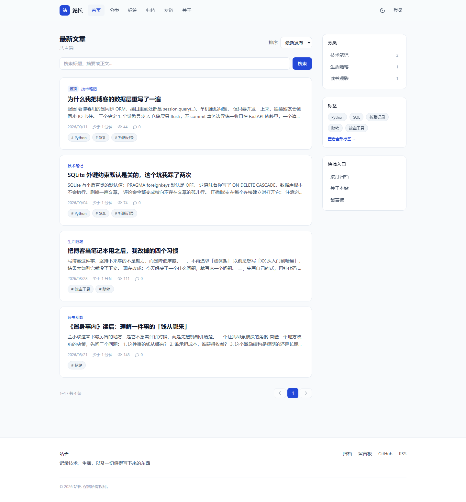
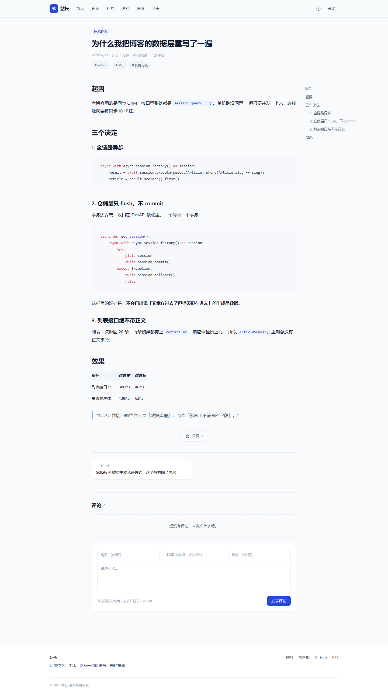
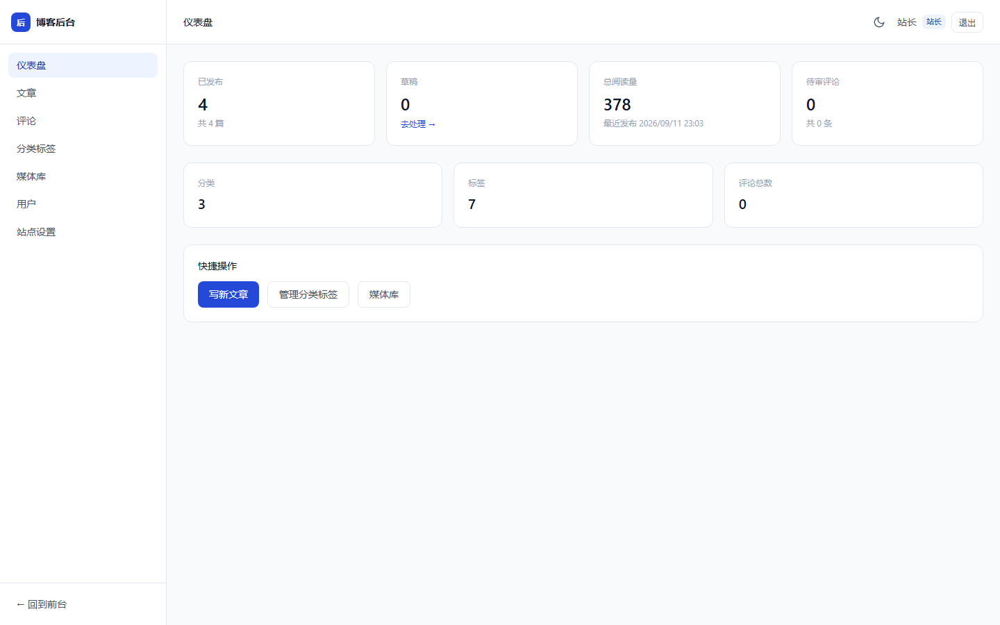
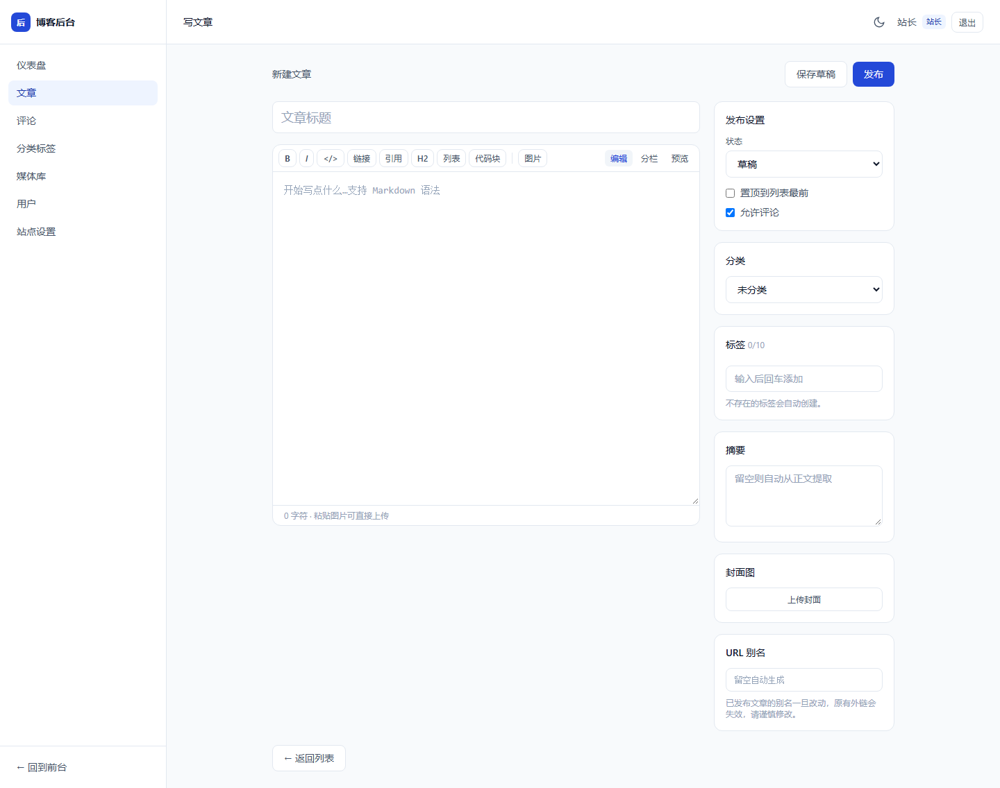
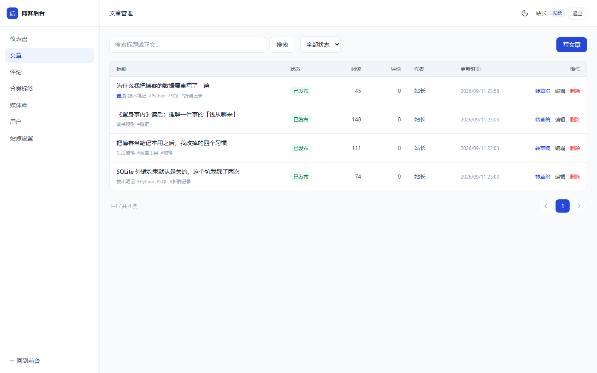
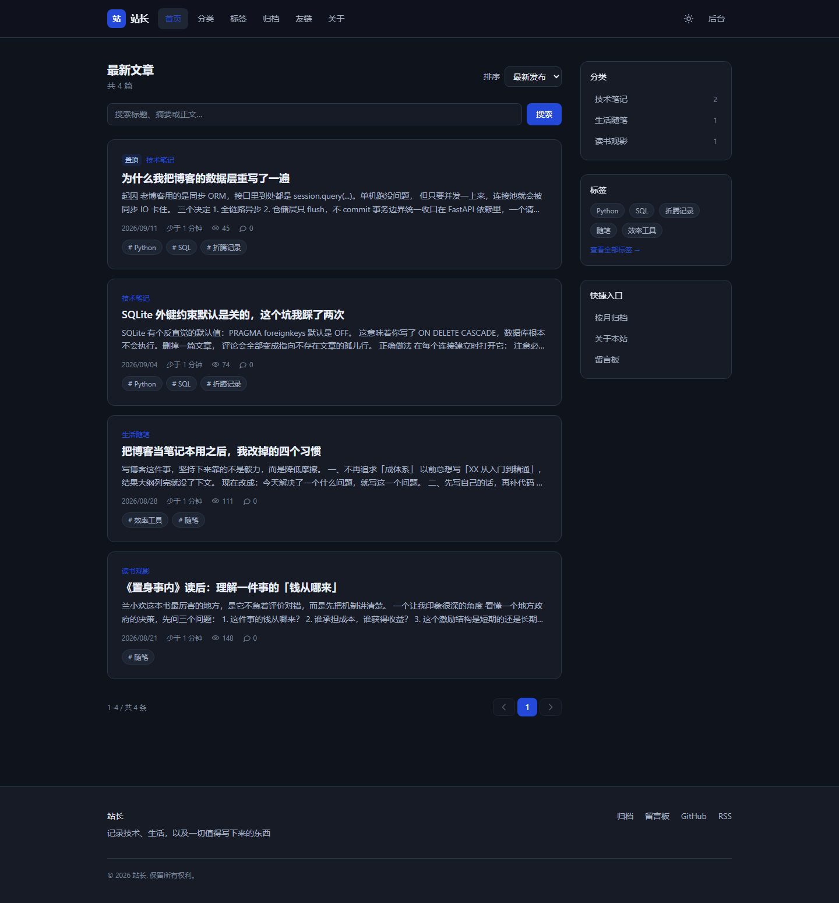

# 个人博客 · Personal Blog

> 一套可以直接上线的个人博客系统。技术笔记、生活随笔、读书观影都往这里放。

[](https://github.com/FurinaLuna/personal-blog/actions/workflows/ci.yml)
[](LICENSE)
[](https://www.python.org/)
[](https://nodejs.org/)
[](https://fastapi.tiangolo.com/)
[](https://vuejs.org/)

前后端分离架构：后端 FastAPI 全异步 + 分层设计，前端 Vue 3 + TypeScript。
**写出来能跑、改起来可验证** —— 822 个后端测试（SQLite 与 PostgreSQL 双方言各跑一遍）、
54 个前端 spec 文件，外加三个真实浏览器端到端脚本（冒烟 47 项 / 交互 25 项 / 全功能回归 66 项）
与两套数据库方言的真实链路端到端（SQLite 64 条 / PostgreSQL 63 条）。

内容也不是空的：仓库自带一个 **Hexo 旧站迁移工具**（`tools/hexo_import/`，141 条用例），
已用它把 23 篇历史文章连同图片一起迁进本站 —— 见 [从 Hexo 旧站迁移内容](#从-hexo-旧站迁移内容)。

---

## 目录

- [项目简介](#项目简介)
- [功能一览](#功能一览)
- [界面预览](#界面预览)
- [技术栈](#技术栈)
- [快速开始](#快速开始)
- [从 Hexo 旧站迁移内容](#从-hexo-旧站迁移内容)
- [常用命令](#常用命令)
- [目录结构](#目录结构)
- [配置项](#配置项)
- [API 概览](#api-概览)
- [测试与验证](#测试与验证)
- [部署](#部署)
- [贡献指南](#贡献指南)
- [许可证](#许可证)

---

## 项目简介

一套自用的个人博客，两个目标：

1. **内容侧要好用** —— Markdown 写作、分类标签、草稿保护、评论审核、媒体库，
   后台该有的都有，不为了"简洁"牺牲功能。
2. **工程侧要可信** —— 分层清晰、类型完整、每个功能都有对应的测试或验证脚本。
   仓库里那些「只有真实浏览器才能发现」的坑（登录后被弹回登录页、
   后台布局嵌套导致子页面不渲染）都写进了文档，不是靠运气修好的。

它不是空壳模板：**本站正在跑的就是这份代码**，23 篇历史文章已经从 Hexo 旧站迁进来
（含 50 张图片和站点档案），所以 README 里的数字都是真站上量出来的。

默认 SQLite 零依赖启动，需要时一个环境变量切到 PostgreSQL。

## 功能一览

### 内容与前台

| 功能 | 说明 |
|---|---|
| 文章状态 | 草稿 / 已发布 / 已归档；支持置顶、封面图、阅读时长自动估算 |
| Markdown 渲染 | `marked → DOMPurify 白名单消毒 → 增强`（标题锚点、代码高亮、外链 `rel`、图片懒加载） |
| 代码块 | 按需注册 17 种语言（比 `lib/common` 省 60% 体积）、右上复制按钮、右下语言标签 |
| 阅读体验 | 自动目录（桌面侧栏 + 移动端浮动抽屉）、阅读进度条、相关文章推荐 |
| **目录与侧栏的滚动独立性** | 桌面目录是 `position: fixed` 的面板、**自身可滚**（`max-height: calc(100dvh - 8rem)` + `overscroll-behavior: contain`），长目录（实测 1990px）能滚到底，且滚它**不会带走正文**；首页侧栏的分类列表同理（上限 `min(20rem, calc(100dvh - 30rem))`），标签与快捷入口始终可见 |
| 组织方式 | 分类（一对一）、标签（多对多）、按月归档、关键词搜索 |
| 搜索 | **两种方言各有自己的加速路径**：SQLite 走 FTS5（trigram 分词 + bm25 + 高亮片段），PostgreSQL 走 `pg_trgm` + 3 条 GIN 索引；1–2 字的短查询两边都退回 LIKE 兜底（三元组索引的固有限制），端点单独限流 30/分 |
| 系列 / 合集 | 多篇文章编成一个系列；详情页显示系列导航（上下篇），前台有系列聚合页与系列详情页，后台可增删改；删除系列只解关联，文章保留 |
| 互动 | 两级评论（先审后发）、点赞、阅读量统计 |
| 友链 | 独立页面按 `sort_order` 展示（头像/首字占位、介绍、新窗口 + `noopener`）；后台可增删改、启停（隐藏的条目只对站长可见）；地址只接受 http/https（与评论共用同一套校验） |
| 列表页 | 服务端分页 + 五种排序 + 筛选，**全部状态存在 URL query**，刷新/分享/前进后退都能还原 |
| 主题 | 亮 / 暗 / 跟随系统三态，首屏无闪烁 |
| 订阅与分享 | RSS 2.0 与 sitemap，每页独立标题与 Open Graph 卡片 |

### 后台

- **文章编辑器**：分栏预览、工具栏、粘贴/拖拽上传图片、**本地草稿自动保存与恢复**
- **评论审核**：待审队列、逐条通过/撤下、删除
- **分类与标签**：增删改，附带文章计数
- **媒体库**：上传、预览、复制 Markdown 片段、删除
- **用户管理**：分配账号与角色（不开放自助注册）
- **站点设置**：站点信息、社交链接、关于页内容、评论开关、前台登录入口开关
- **友链管理**：增删改、排序、一键隐藏/显示（未启用的条目不会出现在前台 `/links`）
- **全局错误边界**：任一组件抛错渲染兜底页并提供重试，而不是整页白屏

### 后端与运维

- FastAPI + SQLAlchemy 2.0（全异步）+ Pydantic v2，严格分层
  （`api` / `services` / `repositories` / `models` / `schemas`）
- JWT 双 Token（access 120 分钟 / refresh 7 天），401 静默续期（带单飞锁防并发重复刷新）；
  **refresh token 存在 httpOnly Cookie 里、access token 只留在内存** —— JS 读不到任何长效凭证，
  XSS 拿不走能自我续期的那一枚。代价是刷新页面后必须先用 Cookie 静默续期再问 `/auth/me`，
  这条路径断了就是「刷新页面必掉线」，前后端都有专门用例守着；
  refresh token **落库轮换**（只存 jti 哈希，已轮换的令牌再次出现即判定盗用并吊销整族，30 秒宽容窗口容忍多标签页同时刷新）；
  登出是真吊销（`token_version += 1` + 按行吊销全部会话），而刷新接口另有一道 `Origin` 白名单防线挡 CSRF ——
  ⚠️ 因此 **`CORS_ORIGINS` 兼作安全白名单**，分域部署时前端来源必须写进去
- 三级角色：访客 / 作者 / 站长；三层防护：依赖注入门禁 → 资源归属校验 → Schema 层防提权
- 上传安全：Pillow 真实解码判型（不信任客户端声明的 `Content-Type`）、流式限流读、
  扩展名白名单（默认禁 SVG / HTML）、服务端生成文件名
- 请求 ID 透传 + 结构化 JSON 日志 + 限流（登录 5/分、评论 5/分、点赞 20/分、搜索 30/分）。
  ⚠️ 限流是**进程内**计数，所以必须单 worker 运行：Dockerfile / compose 写死 `--workers 1`，
  启动期还会检查 `WEB_CONCURRENCY` / `UVICORN_WORKERS` / `sys.argv`，生产发现多 worker
  直接拒绝启动（多开会把配额按 worker 数静默放大）
- 评论邮件通知：有人回复你的评论时给被回复者发信（附签名退订链接），
  非站长发的新评论提醒站长（**待审也提醒**——那正是需要审核的时刻）；
  SMTP 默认关闭（仅配 `SMTP_ENABLED=true` 才发信），发信是评论接口提交后触发的后台任务，
  **失败只记日志，绝不影响评论接口返回**；退订幂等，重复点击与重复提交都返回成功
- `/health` 存活探针与 `/ready` 就绪探针（真实查库，未就绪返回 503）
- Alembic 迁移（升降级都验证过）；Docker + nginx + docker-compose

## 界面预览

| 首页 | 文章详情 |
|---|---|
|  |  |

| 后台仪表盘 | 文章编辑器 |
|---|---|
|  |  |

| 后台文章管理 | 暗色主题 |
|---|---|
|  |  |

## 技术栈

| 层 | 选型 | 为什么 |
|---|---|---|
| 后端框架 | FastAPI | 原生异步 + 依赖注入 + 自动 OpenAPI 文档 |
| ORM | SQLAlchemy 2.0（async） | 全链路异步，避免同步驱动拖住事件循环 |
| 校验 | Pydantic v2 | 请求/响应模型即文档，字段级错误可直接回填表单 |
| 数据库 | SQLite（默认）/ PostgreSQL | 开发零依赖，生产一行环境变量切换 |
| 迁移 | Alembic | 表结构变更可回滚，不靠手改生产库 |
| 认证 | PyJWT + bcrypt | 双 Token；密码只存哈希 |
| 前端框架 | Vue 3 + TypeScript | 组合式 API + 完整类型 |
| 构建 | Vite | 开发态秒级热更新；产物按路由与库分包 |
| 状态 | Pinia | 认证 / 站点档案 / 主题三个 store |
| 样式 | Tailwind CSS | 语义色变量集中定义，换肤只改一个文件 |
| Markdown | marked + DOMPurify + highlight.js | 渲染与消毒分离，消毒排在增强之前 |
| 测试 | pytest / Vitest | 后端 822 例（SQLite + PostgreSQL 双方言）、前端 54 个 spec 文件 / 849 例 |
| 端到端 | Chrome DevTools Protocol | 复用本机 Chrome，不引入 Playwright 的数百 MB 依赖 |

## 快速开始

**前置要求**：Python ≥ 3.11、Node ≥ 20。默认使用 SQLite，不需要额外装数据库。

```bash
git clone https://github.com/FurinaLuna/personal-blog.git
cd personal-blog
```

**1. 启动后端**

```bash
cd backend
python -m venv .venv
.venv/Scripts/activate          # Windows
# source .venv/bin/activate     # macOS / Linux
pip install -e ".[dev]"
cp .env.example .env
uvicorn app.main:app --reload --app-dir src --port 8000
```

**2. 启动前端**（另开一个终端）

```bash
cd frontend
npm install
npm run dev
```

| 入口 | 地址 |
|---|---|
| 前台 | <http://localhost:5173> |
| 后台 | <http://localhost:5173/admin> |
| API 文档 | <http://localhost:8000/docs> |
| 就绪检查 | <http://localhost:8000/ready> |

**默认管理员**：`admin` / `admin123456` —— **生产环境请立刻修改**。

首次启动会自动建表并写入 4 篇演示文章；不想要演示数据就把 `.env` 里的
`SEED_DEMO_DATA` 设为 `false`。
（**演示数据只在库为空时写入**：站点档案、站长账号、演示文章、友链、留言板各有自己的
「已存在就跳过」守卫，所以改过站点设置或删过演示文章之后，重启不会把它们变回来。
迁移进来的真实内容同理，不会被 seed 覆盖。）

装了 `make` 的话，`make install` + `make dev` 可以一步到位。
已经有一个 Hexo 旧站？跳到 [从 Hexo 旧站迁移内容](#从-hexo-旧站迁移内容)。

## 常用命令

```bash
make help          # 列出全部命令
make install       # 安装前后端依赖
make dev           # 同时启动前后端
make check         # 提交前跑这个：ruff + 格式 + 后端测试 + 前端单测
make test-all      # 前后端测试
make build         # 前端类型检查 + 生产构建
make migrate       # 应用数据库迁移（拉取了新代码后**先跑这个**，见下方「升级已有开发库」）
make smoke         # 真实浏览器冒烟（47 项，需先 make dev）
make interaction   # 真实点击的交互验证（25 项，需先 make dev）
make full-check    # 全功能回归 + 数据基线核对（66 项，自清理，需先 make dev）
make migration m="add xxx field"   # 生成迁移
make docker-up     # 容器化启动
```

Windows 上没有 `make` 时，每个目标的原始命令都写在 `Makefile` 里。

> **升级已有开发库**：拉取带新迁移的代码后，`backend/blog.db` 还停在旧版本，
> 而**模型已经按新结构查询**。此时直接 `make dev` 会在启动期就炸：
>
> ```
> sqlalchemy.exc.OperationalError: no such column: site_profile.contact_qrcodes
> ERROR:    Application startup failed. Exiting.
> ```
>
> 前台看到的现象是「后端起来了但 `POST /auth/login` 返回 500」（其实进程根本没起来）。
> 修法是先迁移再启动：
>
> ```bash
> make migrate      # alembic upgrade head
> make dev
> ```

## 从 Hexo 旧站迁移内容

仓库自带 `tools/hexo_import/`（**独立于 `backend/` 的 venv**，只用标准库 + Pillow）：

| 模块 | 职责 |
|---|---|
| `parse_hexo.py` | 读旧站仓库：文章 front-matter、本地图片资源、`_config.yml` |
| `transform.py` | 正文归一化成新站安全渲染器接受的形式 |
| `preflight.py` | 干跑体检 → Markdown 报告 |
| `import_hexo.py` | 走 HTTP API 写数据（默认 dry-run） |

### 为什么走 HTTP API 而不是直接写库

1. **复用整套服务层校验**：图片过 Pillow 真解码（不是看扩展名）、像素炸弹上限、体积上限、
   正文长度、slug 唯一化、标签自动创建 —— 直插 DB 等于把这些全部绕过；
2. **顺带拿到衍生数据**：缩略图与多尺寸变体（AVIF/WEBP）、附件记录都由 `AttachmentService` 生成，
   直插 DB 只能得到一个"能显示的原图"；
3. **可重跑、可对任何环境用**：本地 / 预发 / 线上只是 `--api` 不同；
4. **留痕**：附件与文章都有真实创建记录，事后能查、能删、能回滚。

代价是慢（50 张图要真编码变体）且依赖服务在跑；对一次性迁移值得。

### 幂等性

- **图片**：先按内容 SHA-256 查本地缓存（`--cache`，默认 `.import-cache.json`）；没有再上传。
  服务端文件名由脚本指定为 `{sha256[:16]}{ext}`，同一份内容重复上传只会得到同一个 URL（覆盖写），
  不会产生垃圾文件；
- **文章**：导入前拉一次含草稿的全站列表，拿到已有 slug 集合。slug 已存在默认跳过，
  加 `--update` 则改用 `PATCH` 覆盖正文。两种模式重复跑都收敛到同一结果。

### 怎么用

```bash
# 1) 预检：把必须知道的事先算清楚（不发任何写请求）
python tools/hexo_import/preflight.py --hexo /path/to/hexo-site \
    --out deliverables/hexo-migration-preflight.md

# 2) 干跑：只打印将要发生什么
python tools/hexo_import/import_hexo.py --hexo /path/to/hexo-site

# 3) 试几篇（按文件名或 stem 指定，可重复）
python tools/hexo_import/import_hexo.py --hexo /path/to/hexo-site --apply \
    --only 后端学习路线 --only 农大迷你马拉松

# 4) 全量导入
python tools/hexo_import/import_hexo.py --hexo /path/to/hexo-site --apply \
    --report deliverables/hexo-migration-report.json
```

| 参数 | 作用 |
|---|---|
| `--apply` | 真的写数据。**默认是 dry-run**，不加就什么都不发 |
| `--only 名字` | 只处理指定文章（可重复），用来先拿几篇试水 |
| `--limit N` | 最多处理前 N 篇 |
| `--update` | 已存在的文章改用 `PATCH` 覆盖；默认跳过 |
| `--top-threshold N` | 旧站 `sticky >= N` 才保留为置顶（默认 24）。传 `0` 表示"有 sticky 就置顶" |
| `--cache` / `--report` | 上传缓存文件 / 逐篇结果 JSON |

凭据从**环境变量**取（`ADMIN_USERNAME` / `ADMIN_PASSWORD`），不从命令行取 ——
命令行参数会进 shell 历史与进程列表。图片缺失时**不中断**，如实记进尾注后继续下一篇
（迁移最怕"跑到第 17 篇崩了"）。

### 本站的实际迁移结果（23 篇）

| 项 | 实测 |
|---|---|
| 文章 | **23 篇**（其中 `hide: true` 的 4 篇按**草稿**迁入，前台不出现） |
| 正文图片 | 引用 54 处，**去重后 50 张 / 13.9 MB**，全部上传成功 |
| 封面 | 9 篇 |
| 分类 / 标签 | 13 / 27 |
| 置顶 | **4 篇**（旧站 16 篇带 `sticky`，但阈值 24 只留 3 篇迁移文章 + 1 篇演示文章） |
| **无法恢复的图片** | **4 张**，都在 `FastAPI框架` 一篇里 |

### 迁移中真正踩到的坑（都不是"搬文件"能想到的）

1. **新站安全渲染器禁 `style` 属性** —— 这让整件事从"文件搬运"变成"内容归一化"：
   旧文里靠内联样式实现的圆角/阴影无法保留，得逐类判断是丢掉还是转成语义标记。
2. **图片 URL 绝不能自己拼**。旧站图片在 `source/_posts/<name>/` 下，而新站附件路径多一层月份目录；
   第一版自己拼路径 → **14/14 全 404，且导入过程不报任何错**。必须让服务端返回真实 URL。
3. **标题层级要整体下沉**。旧文里有悬空的 H4（前面没有 H2/H3），直接搬进新站的目录组件
   会让分支挂错父级；迁移时统一下沉一级。
4. **Python 注释被当成 Markdown 标题改写**：围栏代码块的判断漏了一行，
   于是 `# 这是注释` 被当作 H1 加锚点。旧用例还因为用了 `in` 的子串断言而**假通过**。
5. **本地 slug 估算必须与服务端一致**，否则重跑会重复导入（服务端会另起一个 `-1` 后缀）。
6. **置顶必须远少于每页条数**。旧站 16 篇有 `sticky` 权重，全保留会让首页第一页几乎全是置顶徽标，
   头条机制失效。改用阈值 24 只留 3 篇；原始权重写进每篇尾注，将来想改可反悔。
7. **4 张图彻底无法恢复**：旧站 git 全历史、`public/`、线上站点都没有（线上返回 404）。
   不静默跳过 —— 在受影响文章的尾注里如实列出，并写进 `deliverables/hexo-migration-report.json`。

迁移工具的 141 条用例里，有 13 条**直接跑真实旧站仓库**，所以上面这些判断都有回归网兜着：

```bash
cd backend && .venv/Scripts/python -m pytest ../tools/hexo_import/tests -q
```

> 迁移的是**文章内容 + 站点档案**。旧站的「关于 / Lab / 播放列表」页面、友链数据、
> Twikoo 评论都不在迁移范围内。站点档案（站名、副标题、个人介绍、社交链接、邮箱）
> 已按旧站的值填好，要再改就在后台「站点设置」里改。

## 目录结构

```
personal-blog/
├── backend/                        # FastAPI 后端
│   ├── src/app/
│   │   ├── main.py                 # 应用工厂：中间件 / 异常处理 / 探针
│   │   ├── config.py               # 配置（全部来自环境变量）
│   │   ├── api/                    # 路由、依赖注入、限流、请求上下文中间件
│   │   │   └── v1/                 # 按资源分组的端点
│   │   ├── models/                 # SQLAlchemy 模型（15 张表：13 个实体 + 2 张关联表）
│   │   ├── schemas/                # Pydantic 请求/响应模型
│   │   ├── services/               # 业务规则唯一所在地
│   │   ├── repositories/           # 数据访问（只 flush，不 commit）
│   │   ├── db/                     # 会话 / 基类 / 自定义类型 / 种子数据
│   │   └── utils/                  # 安全 / 存储 / 日志 / 限流 / 异常
│   ├── tests/                      # 822 个 pytest 用例（SQLite / PostgreSQL 双方言）
│   ├── alembic/                    # 数据库迁移
│   ├── README.md                   # 后端说明（分层职责 / 迁移 / 运维端点）
│   └── storage/                    # 上传的图片与附件（内容不入库）
├── frontend/                       # Vue 3 前端
│   ├── src/
│   │   ├── api/                    # HTTP 客户端 + 各模块接口
│   │   ├── components/             # 可复用组件
│   │   ├── composables/            # useAsyncData / useAction / useHead / useSiteName / useTocTree …
│   │   ├── layouts/                # Default / Admin / Blank 三套布局
│   │   ├── router/                 # 路由表 + 守卫
│   │   ├── stores/                 # Pinia：auth / site / theme（3 个）
│   │   ├── styles/                 # ★ 样式：tokens / base / components / prose / vendor
│   │   ├── utils/                  # Markdown 渲染 / 格式化 / 预取 / 建站时长 / 状态元数据
│   │   └── views/                  # 前台 14 页 + 后台 11 页
│   └── src/**/*.spec.ts            # 54 个 spec 文件 / 849 个 Vitest 用例
├── deploy/                         # Dockerfile × 2 + nginx.conf / nginx.https.conf /
│                                   #   nginx-common.inc / nginx-server.inc / security-headers.inc
├── docs/
│   ├── DESIGN.md                   # ★ 完整设计与实现方案（五大模块）
│   ├── ASSESSMENT.md               # 全面评估（风险 / 升级 / 功能 / 性能）
│   ├── CODE-REVIEW.md              # 代码评审（臃肿 / 冗余 / 重复 / 内聚耦合）
│   ├── STYLEGUIDE.md               # ★ 样式规范（文件组织 / BEM 命名 / 验证方法）
│   ├── ROADMAP.md                  # 迭代路线图与进度
│   ├── MODULES.md                  # ★ 模块边界权威说明（职责 / 依赖方向 / 禁止事项 / 扩展点）
│   ├── OPTIMIZE-QUICK-WINS.md      # 前端优化「1-2 天见效」清单（改哪个文件、改什么、为什么）
│   ├── TEST-REPORT.md              # 全功能回归测试报告（2026-09-12 历史快照 + 后续批次登记，最新一批含目录/分类滚动与旧站内容迁移）
│   ├── devlog/                     # 逐日开发日志（决策 / 验证 / 踩坑）
│   ├── test-reports/               # full-check 各环境的运行报告（JSON）
│   └── screenshots/                # 界面截图
├── tools/
│   ├── hexo_import/                # ★ Hexo 旧站内容迁移（parse / transform / preflight / import）
│   │   ├── preflight.py            # 干跑体检 → Markdown 报告
│   │   ├── import_hexo.py          # 走 HTTP API 导入（默认 dry-run，幂等）
│   │   └── tests/                  # 141 条用例（其中 13 条直接跑真实旧站仓库）
│   ├── e2e_live/
│   │   ├── e2e_run.py              # 真实环境端到端：临时空库 + alembic 建表 + 独立
│   │   │                           # uvicorn 进程，64 条用例（HTTP 断言 + 直连库复核）；
│   │   │                           # E2E_DB=postgres 切 PostgreSQL 方言（默认是 SQLite）
│   │   └── probe.py                # 定点复现某个 500 并抓取服务端堆栈
│   ├── smoke-check.mjs             # CDP 冒烟：逐页渲染与关键交互（47 项，只读）
│   ├── interaction-check.mjs       # CDP 交互：写操作与失败路径（25 项，对称还原）
│   ├── full-check.mjs              # CDP 全功能回归：写操作生命周期 + 数据基线核对（66 项，自清理）
│   ├── deploy-check.mjs            # 真构建镜像 + 真起 compose 栈，逐条验证部署行为（49 项）
│   ├── showcase-demo.mjs           # CDP 功能演示：用户视角完整旅程回放（11 步截图断言）
│   ├── style-baseline.mjs          # 采集关键元素的计算样式（样式重构前/后比对）
│   ├── style-diff.mjs              # 比对两份样式基线，有差异即报
│   └── style-ab-font.mjs           # 针对字体令牌修复的 A/B 验证
├── shots/                          # E2E 运行产物（验证脚本自动生成，已 gitignore）
├── Makefile                        # 常用命令入口
├── docker-compose.yml
├── CONTRIBUTING.md                 # 贡献指南
├── SECURITY.md                     # 安全策略与部署注意事项
├── CHANGELOG.md                    # 更新日志
└── LICENSE                         # MIT
```

## 配置项

全部通过环境变量注入。Docker 部署的模板是根目录
[`.env.example`](.env.example)，裸机开发的模板是
[`backend/.env.example`](backend/.env.example)（内容更全，含上传白名单、
限流、图片尺寸档位等）。
**开发环境大部分可保持默认**，生产必须改的项已在表中标出。

| 变量 | 默认值 | 说明 |
|---|---|---|
| `APP_ENV` | `development` | ⚠️ 生产设 `production`（会自动关闭 `/docs` 与 `/redoc`） |
| `DEBUG` | `true` | ⚠️ 生产设 `false` |
| `DATABASE_URL` | SQLite 文件 | 生产推荐 `postgresql+asyncpg://…` |
| `DB_AUTO_CREATE` | `true` | ⚠️ 生产设 `false`，改由 `alembic upgrade head` 管表结构 |
| `JWT_SECRET_KEY` | 开发占位值 | ⚠️ 生产必须换：`openssl rand -hex 32` |
| `ACCESS_TOKEN_EXPIRE_MINUTES` | `120` | access token 有效期 |
| `REFRESH_TOKEN_EXPIRE_DAYS` | `7` | refresh token 有效期 |
| `CORS_ORIGINS` | localhost | ⚠️ 生产只填真实前端域名，逗号分隔。**它同时也是刷新接口的 CSRF 白名单**（见上），分域部署时前端来源必须包含在内 |
| `SITE_BASE_URL` | `http://localhost:5173` | RSS / sitemap 里的绝对链接依赖它 |
| `REFRESH_TOKEN_COOKIE_NAME` | `blog_refresh` | 承载 refresh token 的 Cookie 名（httpOnly，Path=`/api/v1/auth`） |
| `SESSION_HINT_COOKIE_NAME` | `blog_session` | 「会话提示」Cookie 名。**非 httpOnly、值恒为 `1`、Path=`/`** —— 前端读它判断值不值得去续期，消掉匿名访客每次进站那次注定 401 的请求。它**不是凭证，不参与任何授权决策** |
| `COOKIE_SAMESITE` | `lax` | ⚠️ 前端与 API **不同域**时必须设 `none`（`lax` 会拦掉跨站 XHR），而 `none` 强制要求 `Secure` |
| `COOKIE_SECURE` | 跟随 `APP_ENV` | 生产 `true` / 开发 `false`。开发环境强制 `true` 会让浏览器拒绝写入该 Cookie |
| `COOKIE_DOMAIN` | 空 | 需要在子域间共享时才填（如 `example.com`，前面不带点） |
| `REFRESH_TOKEN_IN_BODY` | `false` | 非浏览器客户端（curl / CI）拿不到 Cookie Jar 时设 `true`，让响应体也带回 refresh token |
| `SESSION_HINT_COOKIE_NAME` | `blog_session` | 非 httpOnly 的**会话提示** Cookie，让前端知道"值不值得去续期"，从而免掉匿名访客每次进站那次注定 401 的请求。⚠️ 它的 `path` 刻意是 `/`（与 refresh Cookie 的 `/api/v1/auth` 不同），否则页面 JS 读不到它 |
| `STORAGE_DIR` | `./storage` | 上传文件根目录 |
| `MAX_UPLOAD_SIZE` | `10485760` | 10 MB，需与 nginx `client_max_body_size` 一致 |
| `IMAGE_VARIANT_WIDTHS` | `480,800,1600` | 上传时生成的响应式图片档位（宽度不足的档位跳过） |
| `LOG_JSON` | `true` | 访问日志以单行 JSON 输出，便于日志收集器按字段过滤 |
| `LOG_LEVEL` | `INFO` | 日志级别 |
| `TRUST_PROXY_HEADERS` | `false` | ⚠️ 只有部署在可信反代之后才开。`X-Forwarded-For` 可被伪造 |
| `RATE_LIMIT_ENABLED` | `true` | 登录 / 评论 / 点赞 / 搜索限流开关 |
| `SMTP_ENABLED` | `false` | 评论邮件通知总开关。⚠️ 开启还需填 `SMTP_HOST` / `SMTP_USERNAME` / `SMTP_PASSWORD`（授权码） |
| `SMTP_PORT` / `SMTP_USE_TLS` | `465` / `true` | 隐式 TLS；587 STARTTLS 暂不支持 |
| `SMTP_FROM` | 空 | 发件人地址，留空回落到 `SMTP_USERNAME` |
| `ADMIN_USERNAME` / `ADMIN_PASSWORD` | `admin` / `admin123456` | ⚠️ 首次启动后立刻改密码 |
| `SEED_DEMO_DATA` | `true` | ⚠️ 生产设 `false` |

## API 概览

完整交互式文档在 <http://localhost:8000/docs>。主要端点：

| 分组 | 端点 | 说明 |
|---|---|---|
| 认证 | `POST /api/v1/auth/login` | 用户名或邮箱 + 密码。响应体只给 access token，refresh token 走 `Set-Cookie`（限流 5/分） |
| | `POST /api/v1/auth/refresh` | 用 refresh token 续期（限流 30/分）。**请求体可省略**（省略即从 Cookie 取）；带 `Origin` 的请求必须落在 `CORS_ORIGINS` 白名单内 |
| | `POST /api/v1/auth/logout` | 真吊销：失效该用户全部设备的令牌，并下发删除 Cookie 的指令 |
| | `GET /api/v1/auth/me` | 当前用户 |
| | `GET/POST/PATCH/DELETE /api/v1/auth/users` | 用户管理（站长） |
| 文章 | `GET /api/v1/articles` | 前台列表，支持分页 / 排序 / 筛选 / 搜索 |
| | `GET /api/v1/articles/{slug或id}` | 详情（草稿对无权用户返回 404）。**纯读**：不回写任何字段，带 `ETag`，条件请求可命中 `304` |
| | `POST /api/v1/articles/{id}/view` | 记一次阅读（原子自增 `view_count` 并返回最新值；草稿 404，限流 60/分）。计数与详情读取分离，详情才可缓存 |
| | `POST/PATCH/DELETE /api/v1/articles` | 增改删（作者以上） |
| | `GET /api/v1/articles/archive` | 按月归档 |
| | `GET /api/v1/articles/{id}/related` | 相关文章 |
| | `POST /api/v1/articles/{id}/like` | 点赞（限流 20/分） |
| 分类标签 | `GET/POST/PATCH/DELETE /api/v1/categories`、`/api/v1/tags` | 分类与标签；删除只解关联不删文章 |
| 系列 | `GET /api/v1/series` | 系列列表（前台，可选带各系列已发布文章数） |
| | `GET /api/v1/series/{slug或id}` | 系列详情 + 系列内文章（按系列内顺序分页） |
| | `POST /api/v1/series`、`PATCH /api/v1/series/{id}` | 新建 / 修改系列（作者以上） |
| | `DELETE /api/v1/series/{id}` | 删除系列（站长）；其下文章降级为普通文章，内容不受影响 |
| 评论 | `GET /api/v1/comments/article/{id}` | 两级评论树 |
| | `POST /api/v1/comments/article/{id}` | 发表评论（支持匿名，限流 5/分） |
| | `PATCH/DELETE /api/v1/comments/{id}` | 审核与删除（作者以上） |
| 媒体 | `POST /api/v1/attachments/upload` | 上传（真实解码判型 + 流式限流读 + 生成多尺寸变体） |
| | `GET /api/v1/attachments`、`DELETE /api/v1/attachments/{id}` | 媒体库管理 |
| | `POST /api/v1/attachments/backfill-variants` | 给存量图片补生成变体（站长） |
| 统计 | `GET /api/v1/stats/views/daily` | 近 N 天 PV/UV 趋势（站长，缺日补零） |
| 通知 | `POST /api/v1/notifications/unsubscribe` | 凭邮件签名 token 退订评论回复通知（幂等） |
| 站点 | `GET /api/v1/site/profile`、`/stats` | 站点档案与统计 |
| | `PATCH /api/v1/site/profile` | 更新站点设置（站长） |
| 订阅 | `GET /feed.xml`、`/sitemap.xml` | RSS 2.0 与站点地图（后端直出） |
| 运维 | `GET /health`、`/ready` | 存活 / 就绪探针 |

所有响应都带 `X-Request-ID` 头；错误响应体包含 `request_id`，
用户报障时提供它即可在服务端日志里精确定位那一次请求。

## 测试与验证

```bash
make check          # 后端 lint + 格式 + 测试 + 前端单测
make build          # 前端类型检查 + 生产构建
make smoke          # 真实浏览器冒烟（需先 make dev）
make interaction    # 真实点击的交互与失败路径验证（需先 make dev）
make full-check     # 全功能回归 + 数据基线核对（需先 make dev）
```

当前基线：

> **口径说明**：下表里标注「实测」的行是本轮在**当前工作区**跑出来的；
> 涉及远端 CI 的行是历史运行记录（本地未提交的改动还没经过 CI）。
> 数字都会随代码变动而漂移 —— 要判断"此刻到底绿不绿"，请自己跑一遍 `make check` 与三个浏览器脚本，
> 而不是从这里抄一个数。逐批的实测登记在 [`docs/TEST-REPORT.md`](docs/TEST-REPORT.md)。

| 检查 | 结果 |
|---|---|
| `ruff check` / `ruff format --check` | 全部通过 |
| `import-linter` | 2 条分层契约 KEPT（api → services → … → config；utils 叶子） |
| `pytest`（默认 SQLite） | **822 collected / 817 passed / 5 skipped**（0 failed / 0 errors） |
| `pytest`（`TEST_DATABASE_URL` 指向 PostgreSQL） | 与 SQLite **共用同一套 822 条用例**，差别只在 `sqlite_only` 那几条跳过数（SQLite 跳 5 条，PG 跳 1 条）。⚠️ 本机没起 PostgreSQL，所以此处的**具体通过数以上面 CI 的 `backend-postgres` 作业为准**，不在 README 里钉一个必然过期的数字 |
| `vue-tsc --noEmit` | 0 报错（全仓库） |
| `eslint .` | 0 报错 |
| `vitest run` | **54 files / 849 passed**（含 `useTocTree` / `useScrollY` / `ElevatorBar` / `useSiteName`（经 `useHead`）/ `uptime` / `SiteUptime` 等新增 spec） |
| `vite build` | 成功（vendor 分包 gzip ~43 KB、markdown 分包 gzip ~31 KB、主包 gzip ~30 KB） |
| `alembic upgrade head` / `downgrade base` | 18 条迁移升至 head = **15 张表**（含 `article_tags` 关联表与 `article_revisions` / `notification_opt_outs` / `visit_logs` 这类附属表）+ `alembic_version`；本轮新增的 `contact_qrcodes` 是 `site_profile` 上的加列，不新增表。SQLite 另有 FTS5 的 5 张虚拟/影子表，PostgreSQL 上另有 `pg_trgm` 扩展与 3 条 GIN 索引。降回 base 只剩 `alembic_version`，复升结构一致；**SQLite 与 PostgreSQL 两种方言都跑升→降→升** |
| `tools/smoke-check.mjs` | **47/47**。含移动端几何实测：390×844 下电梯栏与目录按钮竖直间距 **24px**（阈值 12px）、水平重叠 40px；**E-H1** 首页分类列表独立滚动（有高度上限 + 自身可滚 + 不串联页面）；**E-H2** 站点名在标签页 / `og:site_name` / 页脚三处一致（不再各自写死）；**E-H3** 页脚建站时长格式 |
| `tools/interaction-check.mjs` | **25/25**（登录失败路径 / 匿名留言待审 / 评论审核 / 状态切换 / 设置保存 / 窄屏布局 / 草稿恢复 / 评论链路与空值拦截）。其中两条用例此前常年报红、本批才修掉，都是**断言写错而不是产品缺陷**：① 成功文案的断言只匹配「评论已发布」与「等待站长审核」两个片段，而组件实际输出的是「评论已提交，等待站长审核后显示」—— 第二个片段后面紧跟一个「后」，于是两个分支都落空；② 「有没有错误提示」只看"此刻页面上存在错误文本"，于是把**上一条用例残留的 toast** 算到了本次头上 —— 改成只看**新出现**的错误提示 |
| `tools/full-check.mjs` | **66/66** ×2 环境（dev 5173 + 生产包 4173）：后台写操作生命周期 / 认证与主题 / 列表边界 / 详情页交互 / 站点元信息 / **E5–E8 电梯栏 + 二维码 + 目录改造**；结束核对数据基线。`A0` 断言刷新 Cookie 以 `httpOnly` 种在 `/api/v1/auth` 下——它是整套凭证方案的地基，失败时不希望靠「某个后台页面挂了」倒推。五条**几何/时序**断言实测通过：`E7e`（`aria-current` 跟随滚动）、`E7f`（侧栏吸住：读长文时目录**整体**留在视口内，采样含 95%/100%）、`E7g`（正文列 760px、一行 42 个中文字）、`E7h`（目录自身可滚 + `overscroll: contain` + 面板不随页面漂移）、`E8`（移动端不重叠） |
| `tools/e2e_live/e2e_run.py` | **64/64**：真实进程 + 真实数据库的全链路端到端（6 条主流程 + 异常边界）。R08 断言站点档案字段与库内一致（含新增的 `contact_qrcodes`：**键必须存在**、类型为数组或 null、条目只允许 `kind`/`label`/`image_url`/`value` 四个键），因此它同时证明新迁移真的跑过了。A01 断言「响应体没有 refresh_token 且 Cookie 以 httpOnly 下发」。运行前后比对 `blog.db` 指纹确保零污染 |
| **GitHub Actions（8 个作业）** | **全部通过**（run #53，2026-09-24）—— 本项目历史上第一次远端 CI 全绿。账单锁期间（run #42~#47）所有作业都是 `steps=0` 启动即失败，那段时间的结论只能靠本地实测；解锁后的第一批反馈抓到 3 个真问题（迁移未格式化 / 部署配置测试写死旧布局 / 部署脚本隐式依赖本地 `.env`），见 `docs/devlog/2026-09-22.md` 批次 15 |
| `tools/deploy-check.mjs` | **49/49**：真构建两个镜像、真用 compose 起一套完整栈（HTTP + HTTPS 两套外壳），逐条验证容器形态与部署行为（见「部署产物验证」） |

> **一个环境注意点**（不是代码问题）：
> `tools/e2e_live/e2e_run.py` 用 `tempfile.mkdtemp()` 建工作目录。在受限环境（沙箱 / 只读 TEMP）里，
> mkdtemp 建出来的目录可能被加上不可访问的 ACL —— 表现是脚本刚起步就
> `PermissionError: [WinError 5] .../blog-e2e-xxxx/storage`。这不是脚本缺陷，
> **换台机器或换 TEMP 即可**；详见 [`docs/devlog/2026-09-29.md`](docs/devlog/2026-09-29.md)。

> **另一个环境注意点**：在 Windows 上改 `frontend/src/styles/*.css` 时，
> Vite 的 dev server 可能被 Tailwind 写临时文件撞上 watcher 而**整个进程退出**：
>
> ```
> Error: EBUSY: resource busy or locked, watch
>   '.../styles/.components.css.<pid>.<uuid>.tmpdir/components.css.tmp'
> → Node.js v24.20.0（进程退出）
> ```
>
> 连带症状是**编辑静默失败**（`ReplaceFileW EIO` / `Win32 32`）——文件没写进去，
> 而多数编辑器的返回值看不出异常，于是验证跑出与代码无关的假红。
> 可靠流程：**停 dev server → 改 CSS → 读回文件核对 → 清掉 `*tmpdir*` 残留 → 重启**。
> 改 `.vue` / `.ts` 不容易触发，但一样建议先停再改。


**为什么要浏览器脚本**：单测与类型检查都是绿的情况下，
项目里仍然出现过「登录后被弹回登录页」「后台侧边栏渲染两遍」和
「登录 API 200、toast 已弹却卡在登录页不跳转」这类只有真实浏览器才暴露的问题。
`smoke` / `interaction` / `full-check` / `showcase-demo` 四个脚本就是为此留下的回归网。
它们的截图与报告产物统一写入 `shots/`（已 gitignore），不会在仓库根目录留下散落文件。

## 部署

Docker Compose 部署读的是**项目根目录**的 `.env`（compose 的变量插值只认这个位置）：

```bash
cp .env.example .env
vim .env                  # 三处必填：POSTGRES_PASSWORD / JWT_SECRET_KEY / ADMIN_PASSWORD
docker compose up -d --build
```

少了必填项 `docker compose up` 会直接报错并告诉你缺哪个，
**不会**带着仓库里的公开默认密钥启动。容器默认按生产跑
（`APP_ENV=production`、`DEBUG=false`、`DB_AUTO_CREATE=false`、`SEED_DEMO_DATA=false`），
表结构由容器入口自动执行 `alembic upgrade head`。
上线前别忘了把 `.env` 里的 `SITE_BASE_URL` 改成正式域名。

裸机部署（不用 Docker）走 `backend/.env`，流程见
[`docs/DESIGN.md`](docs/DESIGN.md) 第 5 章。

前端 <http://localhost:8080>。后端**不发布**端口，只经 Nginx 反代
（`/api`、`/media`、`/feed.xml`、`/sitemap.xml`）从 compose 内网访问 ——
映射到宿主机就等于绕开了 Nginx 那层的限流、CSP 与安全响应头。
需要调试时：`docker compose exec backend curl -s 127.0.0.1:8000/health`。

生产上线前的完整检查清单、回滚条件见
[`docs/DESIGN.md`](docs/DESIGN.md) 第 5 章，部署注意事项见 [SECURITY.md](SECURITY.md)。

### 备份与恢复

**自动备份（部署默认就开着）**：compose 里有一个 `backup` 服务，用与数据库
**同一个镜像**（`pg_dump` 的版本必须 >= 服务端，同镜像让这条约束天然成立），
每 24 小时落一份 dump 到宿主的 `./backups/`：

```bash
docker compose logs -f backup                          # 看备份有没有在跑
BACKUP_ONCE=1 docker compose run --rm backup           # 立刻备份一次（不启动循环）
BACKUP_HOST_DIR=/mnt/backup/blog docker compose up -d  # 备份放到别的盘
```

- `BACKUP_INTERVAL_SECONDS`（默认 `86400`）与 `BACKUP_KEEP`（默认 `14`）都在 `.env` 里可调；
- 容器重启会**立刻补一次**备份，所以不会出现"重启之后再也没备份过"；
  它是间隔计时器而不是墙钟调度，要卡死在凌晨 3 点跑请用宿主 cron 调 `make backup`；
- 每份 dump 落盘前先写 `.part`、再用 `pg_restore -l` 校验归档可读，通过才改名 ——
  **宁可什么都没有，也不要一个"看起来像备份"的坏文件**；
- 备份落在宿主目录而不是 docker 卷里，是为了能 scp 到别的机器：
  备份和库放在同一个卷里，等于一起丢。

手动/带外备份走 `make backup`（`backend/scripts/backup_db.py`），覆盖两种方言：

| 方言 | 做法 | 产物 |
|---|---|---|
| SQLite | `VACUUM INTO`（**不是**复制文件：开了 WAL 直接 `cp` 会得到不一致的快照） | `backend/backups/blog-<时间戳>.db` |
| PostgreSQL | `pg_dump -Fc`；宿主没有 `pg_dump` 时自动改用 `docker exec <容器> pg_dump` | `backend/backups/blog-<时间戳>.dump` |

两条路径的产物**刻意完全一致**（custom 格式、`blog-<时间戳>.dump` 命名、
只保留最近 14 份、两种后缀一起参与轮转），所以下面的恢复命令对两者都成立。

**恢复**（生产是 PG，所以重点写 PG）：

```bash
# 1) 停掉写入方，避免恢复期间还有新数据进来
docker compose stop backend

# 2) 恢复到一个空库（--clean --if-exists 会先删同名对象）
docker compose exec -T db pg_restore --clean --if-exists -U blog -d blog < backups/blog-<时间戳>.dump

# 3) 起回来并确认
docker compose start backend && curl -fsS http://localhost:8080/api/v1/articles >/dev/null && echo OK
```

SQLite 的恢复更简单：停服务，把 `.db` 文件放回 `DATABASE_URL` 指向的位置即可
（`-wal` / `-shm` 一起删掉，否则会与新文件不匹配）。

> **备份没验证过等于没有备份**。本项目对这条的落实方式是：
> ① 备份脚本每次改动都真的做一次 `pg_dump` → `pg_restore` 到空库 → 核对表数量与
> `alembic_version`（最新一次见 `docs/devlog/2026-09-24.md`）；
> ② 这条演练已经固化进 `tools/deploy-check.mjs`，每次 CI 都会重跑一遍。

### HTTPS

默认部署是**纯 HTTP**（证书与续期属于部署环境，硬塞进仓库只会让人以为已经配好了）。
两种接法，仓库对两种都给了可直接用的配置。

**接法一（推荐）：外层终止 TLS**。Cloudflare / 宿主机上的 Caddy / 云负载均衡
回源到 `127.0.0.1:8080`，把 `TRUST_PROXY_HEADERS` 保持开启。
HSTS 在 `deploy/nginx.conf` 里是**条件式**的：只有外层把 `X-Forwarded-Proto: https`
传进来时才发出。这样做是因为无条件发 HSTS 会把"本站只能用 HTTPS"写进访客浏览器
一整年，而服务端**撤不掉** —— 一个纯 HTTP 的部署会因此把自己锁死。
所以接了 TLS 之后，记得确认外层确实设置了 `X-Forwarded-Proto`
（Cloudflare 与主流反代默认都会设）。

**接法二：仓库自带的自管证书模板**（`deploy/nginx.https.conf` + `docker-compose.tls.yml`）。
不需要手写 nginx 配置，四步：

```bash
# 1) 先按纯 HTTP 起一次（80 端口要用来做 ACME 挑战）
docker compose up -d --build

# 2) 用 certbot 容器签发，产物落到 ./deploy/certs（就是容器里的 /etc/letsencrypt）
docker run --rm \
  -v "$PWD/certbot-webroot:/webroot" \
  -v "$PWD/deploy/certs:/etc/letsencrypt" \
  certbot/certbot certonly --webroot -w /webroot \
  -d example.com --email you@example.com --agree-tos --no-eff-email

# 3) 把 nginx.https.conf 里的 example.com 换成你的域名，再换到 HTTPS 版
sed -i 's|live/example.com|live/你的域名|g' deploy/nginx.https.conf
docker compose -f docker-compose.yml -f docker-compose.tls.yml up -d --build

# 4) 续期：宿主 cron 每天跑一次。注意 cron 里没有 $PWD，写成绝对路径
0 3 * * * cd /srv/personal-blog && docker run --rm \
  -v /srv/personal-blog/certbot-webroot:/webroot \
  -v /srv/personal-blog/deploy/certs:/etc/letsencrypt \
  certbot/certbot renew --quiet \
  && docker compose -f docker-compose.yml -f docker-compose.tls.yml exec -T frontend nginx -s reload
```

几个刻意的设计，改之前请先读 `deploy/nginx.https.conf` 里的注释：

- **两套配置共用同一份站点内容**（`deploy/nginx-server.inc`）：HTTP 版与 HTTPS 版的
  差别只有"外壳"（listen、证书、跳转）。抄成两份的话，"改了 HTTP 版、HTTPS 版没改"
  不会报任何错，只会行为不同。
- **80 端口只做 ACME 挑战 + 跳转**，且跳转写在 `location` 里而不是 server 级 ——
  server 级 `return 301` 属于 rewrite 阶段，会在 location 匹配**之前**执行，
  于是续期挑战也被跳走，而 certbot 只会说"校验失败"，不会告诉你被自己重定向了。
- **HSTS 在 HTTPS 版是无条件的**（那一套自己就是 TLS 终点）。注意
  `includeSubDomains` 的含义是"该域名及其所有子域只能用 HTTPS"，
  同域名下还挂着别的纯 HTTP 服务时请去掉它。
- 换配置**必须重新 build**（nginx 配置是构建期 COPY 进镜像的，`restart` 不生效），
  所以第 3、4 步都带着两个 `-f`；退回纯 HTTP 用
  `docker compose down && docker compose up -d --build`。

上了 HTTPS 之后记得同步改 `.env` 的 `SITE_BASE_URL`（它决定 RSS、
sitemap 与 Open Graph 里的绝对地址）与 `CORS_ORIGINS`。

### 部署产物验证

源码模式跑绿并不等于部署可用 —— 镜像、nginx、compose 插值、容器入口迁移、
自管证书这些路径，pytest 与 Vite dev server **一条都不会经过**。所以有一层专门的验证：

```bash
make deploy-check          # = node tools/deploy-check.mjs，需要 Docker，约 3~5 分钟
```

它自成一体：用独立项目名（`blog-deploycheck`）与临时目录（备份、证书、ACME webroot
都落在系统临时目录），**不碰**开发者的 `.env`、已有的 compose 项目、`./backups`
与 `./deploy/certs`，跑完自己清理。逐条断言的内容包括：

- compose 配置可解析；且**缺少必填变量时必须失败**（负向验证那几条 `${VAR:?}` 保护真的有效）；
- 两个镜像能构建；起栈后 `/health`、首页、深链回退、API 反代、RSS/sitemap、媒体路径都通；
- **首页文档带 CSP**、内联主题脚本的 sha256 在 CSP 白名单里（少一个哈希就会白闪）、
  CSP 没有 `unsafe-inline`；纯 HTTP 下**不发** HSTS、外层声明 https 时**发** HSTS；
- 匿名读接口带 `Vary: Authorization` 且后台路径不被公开缓存（读己之写那个 bug 的回归网）；
- 容器内确实是生产形态（`APP_ENV=production`、`/docs` 404、非 root 运行、storage 是卷）；
- 入口自动迁移把库升到了 head，且最新迁移建的两张表都在；
- **备份真的可恢复**：产出的 dump 被恢复到临时库，核对表数量与 `alembic_version`；
  轮转确实只保留 `BACKUP_KEEP` 份；
- TLS 覆盖文件那套：HTTPS 站点可用、网页带 CSP 与无条件 HSTS、80 跳转到 HTTPS、
  且 **ACME 续期挑战不被跳转吃掉**（能取到 webroot 里的明文文件）。

产物报告写在 `shots/deploy/deploy-report.md`（已 gitignore）。失败时它会自动附上
四个容器的日志；`KEEP=1` 可以保留现场手工排查，`SKIP_TLS=1` 跳过 TLS 阶段加速迭代。


## 贡献指南

见 [CONTRIBUTING.md](CONTRIBUTING.md)。简单说：

1. 从 `main` 切分支：`git checkout -b feat/your-feature`
2. 提交前确保 `make check`、`make build` 全绿；动到路由 / 布局 / 样式层 / 上传链路时
   还要跑 `make smoke`、`make interaction` 与 `make full-check`
3. 提交信息说明**改了什么 + 怎么验证的**
4. 开 PR 并填写模板中的检查清单

安全漏洞请**不要**开公开 issue，见 [SECURITY.md](SECURITY.md)。

迭代计划与进度见 [`docs/ROADMAP.md`](docs/ROADMAP.md)，
逐日的决策与踩坑记录见 [`docs/devlog/`](docs/devlog/)。

## 许可证

[MIT License](LICENSE) © 2026 FurinaLuna

你可以自由使用、修改、分发本项目（包括商用），只需保留版权声明。
