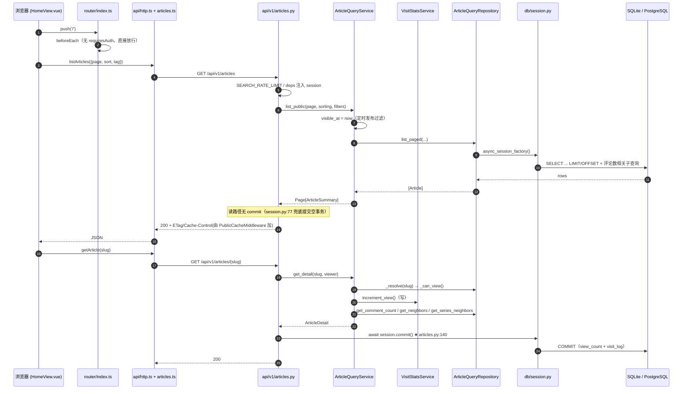
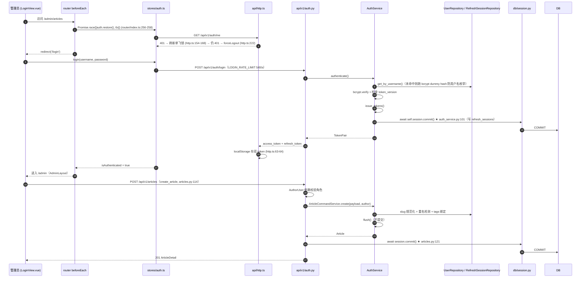
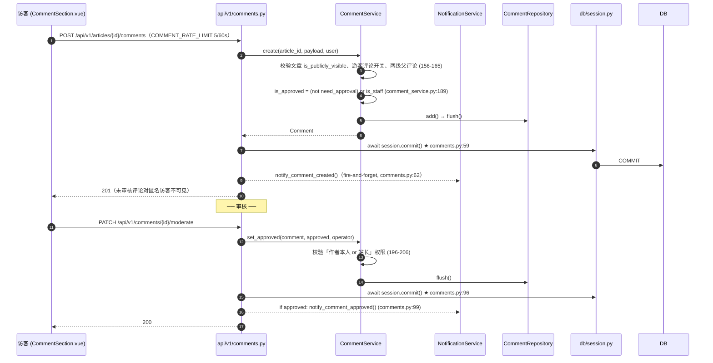

# 个人博客项目 · 架构梳理与风险审计报告

| 项目 | 内容 |
| --- | --- |
| 审计对象 | `D:/Projects/01_个人项目/personal-blog` |
| 审计日期 | 2026-09-25 |
| 审计人 | 高见远（架构师） |
| 审计方式 | **只读**。全程使用 Read / Grep / Glob 实地取证，未修改任何项目文件 |
| 取证基准 | 以**代码现状**为准，README / docs 中的数字仅作对照，不作为结论依据 |
| 行号说明 | 报告中所有 `文件:行号` 均取自实际 Read / grep -n 输出，未做估计 |

> 关于「已知背景」的采信与修正：任务书给出的 4 条背景中，3 条经核实与代码一致（分层与 import-linter 契约、4 张真实表名、`is_production` 的字面实现）；**1 条与当前代码不符**——「PG 生产环境没有全文检索、静默回退 LIKE 全表扫」已被迁移 `20260922_1840` 与 `db/fulltext.py` 的 `pg_trgm + GIN` 分支缓解。详见 §6 的 P1-3 与「§6.4 已核实不是问题的项」。

---

## 0. 一句话架构画像

一个**单体前后端分离**的个人博客：后端 FastAPI 严格四层（api → services → repositories → models/schemas，utils 为叶子），事务提交点集中在 API 路由层；前端 Vue 3 + Pinia + vue-router，按 `meta.layout` 驱动三套布局、路由级懒加载；双数据库方言（SQLite 开发 / PostgreSQL 生产）由仓储与 `db/fulltext.py` 显式分流；部署走 Docker Compose + Alembic 前置迁移 + nginx 反代。

---

## 1. 目录职责表

### 1.1 仓库一级目录

| 路径 | 职责（一句话） |
| --- | --- |
| `backend/` | FastAPI 后端全部源码、迁移、测试与 Python 依赖清单 |
| `frontend/` | Vue 3 + Vite 前端源码、构建配置与 npm 依赖清单 |
| `tools/` | 脱离应用进程的工程脚本：部署校验、E2E 冒烟/交互/全量检查、样式基线对比 |
| `deploy/` | 部署资产：两个 Dockerfile、nginx 配置片段（含安全头/HTTPS）、备份脚本 |
| `docs/` | 设计与过程文档：DESIGN、MODULES、CODE-REVIEW、ASSESSMENT、ROADMAP、STYLEGUIDE、devlog、测试报告、截图 |
| `shots/` | 各类自动化检查产出的截图与报告（smoke / interaction / full / full-preview / deploy） |
| `deliverables/` | 本次及历史交付物存放目录（本次审计报告即写入此处） |
| `.github/` | CI 工作流、Issue 模板、dependabot 配置 |

### 1.2 `backend/` 二级目录

| 路径 | 职责 |
| --- | --- |
| `backend/src/app/` | 应用包本体，所有业务代码都在这里 |
| `backend/src/app/api/` | HTTP 层：路由、**依赖注入**、`deps.py` 限流、缓存中间件、请求上下文中间件、分页工具 |
| `backend/src/app/api/v1/` | v1 版本路由集合（articles / auth / comments / guestbook / notifications / revisions / series / site / stats / taxonomy / links / attachments） |
| `backend/src/app/services/` | 业务层：用例编排、权限判定、领域规则，**只 flush 不 commit**（`auth_service` 例外） |
| `backend/src/app/repositories/` | 数据访问层：全部 SQL/ORM 查询、方言分流、复杂过滤与聚合 |
| `backend/src/app/models/` | SQLAlchemy ORM 模型与枚举，定义表名与约束 |
| `backend/src/app/schemas/` | Pydantic v2 出入参模型（请求体 / 响应体 / 通用分页壳） |
| `backend/src/app/db/` | 引擎与会话工厂、Base、跨方言自定义类型、**全文检索索引的 DDL 与探测** |
| `backend/src/app/utils/` | **叶子层**：异常体系、日志、限流器、密码学、slug、存储、文本、URL、邮件 |
| `backend/src/app/config.py` | Pydantic Settings 配置中枢 + 生产安全门禁 |
| `backend/src/app/main.py` | 应用工厂与组合根（中间件装配顺序、异常处理器、路由挂载、lifespan） |
| `backend/alembic/` | 迁移脚本与 `env.py`；`versions/` 存量 9+ 个版本 |
| `backend/tests/` | 39 个 pytest 文件，与源码分离（不在 `src/` 内） |
| `backend/scripts/` | `docker-entrypoint.sh`、`backup_db.py`、`lint_imports.py` |
| `backend/storage/` | 运行时上传物（uploads / avatars），`.gitkeep` 占位 |
| `backend/backups/` | 备份脚本落盘目录 |

### 1.3 `frontend/` 二级目录

| 路径 | 职责 |
| --- | --- |
| `frontend/src/` | 前端全部源码 |
| `frontend/src/api/` | 按领域拆分的数据访问模块 + `http.ts`（axios 实例、token 存储、401 续期拦截器） |
| `frontend/src/views/` | 页面级组件（前台 14 个 + `admin/` 11 个），**测试与源码同目录** |
| `frontend/src/components/` | 可复用展示组件（ArticleCard、MarkdownEditor/Renderer、Pagination、TOC…） |
| `frontend/src/composables/` | 组合式函数（useAsyncData、useToast、useDraftAutosave、useUpload、useHead…） |
| `frontend/src/stores/` | Pinia store：auth（登录态）、site（站点档案）、theme（暗色主题） |
| `frontend/src/router/` | vue-router 路由表与全局守卫 |
| `frontend/src/layouts/` | 三套布局：Default / Admin / Blank |
| `frontend/src/utils/` | 纯函数：markdown 渲染+消毒、格式化、代码高亮、分页、预取、结构化数据 |
| `frontend/src/types/` | TypeScript 领域类型定义 |
| `frontend/src/styles/` | 全局样式：tokens（CSS 变量）/ base / components / prose / vendor |
| `frontend/src/test/` | vitest 全局 setup（jsdom 环境） |
| `frontend/public/` | 静态资源（favicon） |
| `frontend/dist/`、`dist-qa/` | 构建产物（QA 另有独立产物目录） |

---

## 2. 入口文件

### 2.1 后端应用入口 —— `backend/src/app/main.py`（376 行）

模块级 `app = create_app()`（**main.py:376**），工厂函数 `create_app()` 在 **main.py:261**，按以下顺序装配：

| 步骤 | 行号 | 做了什么 |
| --- | --- | --- |
| 1. 生产门禁 | 263 | `_enforce_production_safety()`（定义于 240-258）：`check_production_safety()` 返回非空即 `raise RuntimeError` **拒绝启动** |
| 2. 日志 | 265-268 | `setup_logging(json_output=settings.log_json, level=settings.log_level)` |
| 3. 建实例 | 270-281 | `FastAPI(...)`，`docs_url/redoc_url` 在生产置 `None`（278-279），`lifespan=lifespan` |
| 4. 中间件 | 304-323 | 按「**内 → 外**」注册：CORS(304-313) → PublicCache(316) → Head(320) → RequestContext(323)。注释 283-302 明确记录了「后注册者在外层」是实测结论，且 Head 必须在 PublicCache 之外，否则 ETag 会退化成空正文哈希 |
| 5. 异常处理器 | 325 | `DomainError` → 领域异常转 HTTP（148-161）；`IntegrityError` → **409 而非 500**（163-180，注释 166-175 解释了「先查重再插入」的竞态窗口是并发下的正常结果） |
| 6. 路由 | 326 / 328 | `api_router` 挂 `settings.api_v1_prefix`；`feed_router` 挂根路径（RSS / sitemap） |
| 7. 运维端点 | 330-363 | `/health`（存活，336 返回 env+version）、`/ready`（就绪，347-359 真查 `SELECT 1`，失败 503）、`/`（361-363） |
| 8. 静态媒体 | 366-371 | `storage.ensure_dirs()` 后 `mount(settings.media_url_prefix, StaticFiles(...))`——顺序不能颠倒 |

`lifespan`（**42-72**）：`ensure_dirs` → 若 `db_auto_create` 则 `create_all` + `_ensure_fulltext_index()`（47-53，注释点明 FTS5 虚拟表不在 `Base.metadata` 里，不补会导致搜索 500）→ `ensure_seed` 后 `await session.commit()`（**58**），失败则 rollback 并 `raise`（59-65，注释特别强调「日志必须与实际行为一致」）→ `_prune_visit_logs()` / `_prune_refresh_sessions()`（67-68）→ `yield` → `engine.dispose()`（72）。

三个「尽力而为」的启动钩子（`_ensure_fulltext_index` 75-100、`_prune_refresh_sessions` 103-117、`_prune_visit_logs` 120-138）**都吞异常只记日志**，各自持有 session 并自行 commit（92 / 113 / 134），注释统一说明「增强功能不能成为启动的单点故障」。

### 2.2 Alembic 入口 —— `backend/alembic/env.py`（133 行）

- **env.py:31**：`config.set_main_option("sqlalchemy.url", settings.database_url)` —— 库地址只从 Settings 取，**不读 alembic.ini**。
- **env.py:43-59**：`include_object` 过滤掉 `articles_fts` 前缀，防止 autogenerate 把 SQLite FTS5 虚拟表/影子表误判成「待删除」。
- **env.py:92 / 108**：按方言在 offline / online 模式分别开关 `render_as_batch`（SQLite 需要，PG 不需要）。
- 显式 import 全部模型（保证 `--autogenerate` 能看到所有表）。

### 2.3 前端入口

| 文件 | 行号 | 关键职责 |
| --- | --- | --- |
| `frontend/src/main.ts` | 13 / 15-16 | `createApp(App)` → `use(createPinia())` → `use(router)` |
| | 25 | `useThemeStore()` 在挂载前应用主题，避免首帧白闪 |
| | **35-36** | `router.isReady().then(() => app.mount('#app'))` —— 注释 30-32 说明：直接 mount 会先按起始路由渲染一次，与守卫里的 `auth.restore()` 形成竞态 |
| `frontend/src/App.vue` | 27 | `computed(() => LAYOUTS[route.meta.layout ?? 'default'] ?? DefaultLayout)` —— 布局由路由元信息驱动 |
| | 31-37 | `onErrorCaptured` 兜底渲染错误页 |
| | 56-61 | `<component :is="layout">` 包裹 `<router-view v-slot>` |
| `frontend/src/router/index.ts`（297 行） | 121-216 | `/admin` **父路由不写 component**，只声明 `meta: { requiresAuth: true, layout: 'admin' }`（131），11 个后台页作为 children 挂载 |
| | 249-286 | `beforeEach`：`requiresAuth` 时 `await Promise.race([auth.restore(), RESTORE_TIMEOUT_MS])`（256-258，6 秒恢复超时）；`requiresAdmin` 且非站长跳首页（270） |
| | 290 | `setAuthRequiredProbe(...)` 把「当前路由是否需要登录」注入 http 层 |
| | 292-295 | `afterEach` 写 `document.title` |

### 2.4 Docker / Compose 入口

| 文件 | 行号 | 关键职责 |
| --- | --- | --- |
| `backend/scripts/docker-entrypoint.sh`（31 行） | 20-26 | `RUN_MIGRATIONS_ON_STARTUP` 非 `false` 时执行 `alembic upgrade head` |
| | **30** | `exec "$@"` —— 让 uvicorn 成为 PID 1，SIGTERM 才能直达（注释 28-29） |
| `deploy/Dockerfile.backend`（107 行） | 33-36 | 依赖清单先于 src COPY；`pip install -r requirements.lock` |
| | 58 / 79 | 建 `--uid 1000` 的 `app` 用户，`USER app` 非 root 运行 |
| | 83-84 | `HEALTHCHECK curl /health` |
| | **106** | `CMD uvicorn app.main:app --host 0.0.0.0 --port 8000 --workers 1 --no-proxy-headers`（注释 88 说明 workers 必须为 1 的原因：限流器是进程内的） |
| `docker-compose.yml`（206 行） | 17-20 | 注释明确：**compose 的变量插值只读根目录 `.env`**，因此 backend 的 `env_file` 也指向根 `.env`（106） |
| | 122 / 128 / 129 | `APP_ENV: ${APP_ENV:-production}`、`DB_AUTO_CREATE: false`、`SEED_DEMO_DATA: false` |
| | 150 | `TRUST_PROXY_HEADERS: "true"`（部署在 frontend nginx 之后） |
| | 166 / 199 | backend 只 `expose` 不发布端口；frontend 发布 `${APP_PORT:-8080}:80` |

---

## 3. 核心模块与数据流

### 3.1 分层与事务边界总览

```
HTTP 请求
  └── api/v1/*.py        路由：鉴权依赖、限流依赖、参数解析、★ await session.commit()
        └── services/    业务编排、权限判定、领域规则          ← 只 flush
              └── repositories/  SQL/ORM、方言分流、聚合       ← 只 flush
                    └── db/session.py  async_sessionmaker(expire_on_commit=False, autoflush=False)
                          └── SQLite / PostgreSQL
```

**事务边界（实测结论）**：

| 位置 | 行号 | 说明 |
| --- | --- | --- |
| `api/v1/articles.py` | **121 / 140 / 150 / 157 / 169** | 建 / 详情（写 view）/ 改 / 删 / 点赞，每个写路由末尾显式 commit |
| `api/v1/auth.py` | 71 / 86 / 95 / 117 / 126 / 135 | 登出 / 改密 / 建用户 / 改用户 / 删用户 |
| `api/v1/comments.py` | **59 / 96 / 107** | 提交评论 / 审核 / 删除 |
| `services/auth_service.py` | **101 / 154 / 172** | **唯一的例外**：`issue_tokens`、`refresh`（复用检测后撤销 + 轮换）在 service 内自行 commit |
| `services/seed.py` | 76 | 种子数据提交 |
| `db/session.py` | **77 / 79** | `get_session` 的**安全网**：正常路径 yield 后 commit；异常 rollback 并 raise |
| `main.py` | 58 / 92 / 113 / 134 | lifespan 内的独立事务 |

> 结论：**主模式是「service/repository 只 flush，写路由显式 commit」**，`get_session` 尾部 commit 只是兜底；`auth_service` 因涉及刷新令牌的原子轮换（撤销旧会话 + 发新令牌必须同一事务）而自行提交。这是一处**刻意的不一致**，但也意味着同一个请求里若既有 `auth_service` 提交又有路由提交，会出现两个事务——目前登录/刷新路由本身不再 commit，所以实际没有双事务，但这条边界缺少注释保护。

**注意**：`GET /articles/{slug_or_id}`（**articles.py:125-141**）是读接口却写库（`VisitStatsService.record` 记访问日志），所以详情请求的 ETag 每 60 秒窗口内也会因 view_count 变化而失效——**详情接口被排除在 PublicCache 白名单之外是必要的**（见 §4 与 P2-2）。

### 3.2 链路 A：前台文章列表 / 详情



要点：

- `list_paged`（`repositories/article_query_repository.py:431-454`）用 `_comment_count_expr()` **相关子查询**一次性取评论数，避免了列表页 N+1。
- 读路径**不 commit**，`get_session`（session.py:77）在 yield 返回后对只读事务执行了一次空 commit——无害但每请求多一次往返。
- 分词检索分流：`ArticleQueryService.search`（`article_query_service.py:239-305`）判断 `len(query) >= FTS_MIN_QUERY_LENGTH(3)` 且 `detect_full_text_search()`；否则 `search_keyword()` 走 LIKE + `_like_score_expr` + `_recency_divisor_expr` 打分。

### 3.3 链路 B：后台登录 + 发文



要点：

- **登录的事务在 service 内提交**（auth_service.py:101），**发文的事务在路由内提交**（articles.py:121）——同一进程内两种惯例并存。
- `ArticleCommandService.update`（`article_command_service.py:128-201`）先 `revisions.snapshot_if_content_changed`（140）做修订快照，再修复 `published_at` 不变量（171-194），最后 `await self.articles.update(...)`（200）——**整个链路无 commit**，由 articles.py:150 提交。
- `refresh`（auth_service.py:154/172）：检测到刷新令牌复用（超窗）→ `revoke_user_sessions` + commit；正常则轮换 + commit。

### 3.4 链路 C：评论提交与审核



要点：`notify_*` 是 **fire-and-forget**（comments.py:62 / 99）——通知发送失败不会回滚已提交的评论事务，也不会有重试；`notification_opt_outs` 表提供退订（`/unsubscribe` 路由）。

---

## 4. 构建与路由配置

### 4.1 `frontend/vite.config.ts`（44 行）

| 项 | 行号 | 内容 |
| --- | --- | --- |
| 别名 | 9-11 | `'@' → ./src`（与 `tsconfig.paths` 保持一致） |
| dev server | 14-18 | `port: 5173`，显式 `host: '127.0.0.1'`（注释：localhost 可能解析为 ::1） |
| proxy | 21-26 | `/api`、`/media`、`/feed.xml`、`/sitemap.xml` → `http://127.0.0.1:8000`，`changeOrigin: true` |
| 分包 | 36-39 | `manualChunks`：`vendor`(vue / vue-router / pinia)、`markdown`(marked / dompurify / highlight.js) |
| 告警阈值 | 32 | `chunkSizeWarningLimit: 900` |

### 4.2 vue-router 路由表结构（`frontend/src/router/index.ts`，297 行）

- **前台**：短路径优先（`/`、`/article/:slug`、`/categories`、`/tags`、`/archive`、`/search`、`/series`、`/series/:slug`、`/about`、`/links`、`/guestbook`、`/unsubscribe`），全部 `component: () => import('...')` **路由级懒加载**。
- **后台**：`/admin`（131）仅声明 `meta: { requiresAuth: true, layout: 'admin' }`，**不写 component**；11 个子页（137-213）继承该 meta，含 `admin/articles/:id/edit` 与 `admin-not-found` 兜底（213）。其中友链 / 留言板 / 用户 / 站点设置额外声明 `requiresAdmin: true`（186/192/198/204）。
- **登录**：`/login` 用 `blank` 布局（113-118）。
- **守卫**：`beforeEach`（249-286）+ `afterEach`（292-295）；`RESTORE_TIMEOUT_MS` = 6s 的 `Promise.race`（256-258）。
- **兜底**：全局 `/:pathMatch(.*)*`（219-224）。
- **元信息类型**：`requiresAuth` / `requiresAdmin` 声明在 24-25。

### 4.3 Tailwind / PostCSS

`frontend/tailwind.config.js`（113 行）：`content` 排除 `*.spec.ts`（8）；`darkMode: 'class'`（11）；颜色与字体走 CSS 变量（`rgb(var(--c-*))`），主题切换只换变量；`@tailwindcss/typography` 插件定制中文排版（54-108）。`postcss.config.js` 为标准 tailwind + autoprefixer。

### 4.4 `tsconfig.json` 关键选项

`strict: true`、`noUnusedLocals` / `noUnusedParameters: true`、`moduleResolution: "bundler"`、`verbatimModuleSyntax: true`、`paths: { "@/*": ["src/*"] }`。

---

## 5. 环境变量与配置

### 5.1 `backend/src/app/config.py`（307 行）分组

| 分组 | 代表字段 | 生产是否必改 |
| --- | --- | --- |
| 基础 | `app_env`(49)、`app_name`、`debug` | **是**（`app_env=production`、`debug=false`） |
| 数据库 | `database_url`、`db_auto_create` | **是**（PG 连接串；`db_auto_create=false`） |
| JWT | `jwt_secret_key`(65，默认 `_DEFAULT_JWT_SECRET` 定义在 18)、access/refresh 有效期、`token_version` | **是**（必须 ≥32 字节随机值） |
| CORS | `cors_origins`(74) | **是**（改成真实域名，禁 `*`） |
| 站点对外地址 | `site_base_url`（影响 RSS / 邮件链接） | **是** |
| 可观测性与限流 | `log_json`、`log_level`、`trust_proxy_headers` | 视部署（反代后设 true） |
| 上传 | 存储目录、体积与 MIME 白名单 | 否 |
| SMTP | 邮件通知凭据 | 用通知则必配 |
| 初始化管理员 | `admin_password`(180，默认 `admin123456` 定义在 19)、`seed_demo_data` | **是**（强口令；`seed_demo_data=false`） |

**门禁实现**：`check_production_safety()`（**233-290**）在生产下逐项检查——默认 JWT（253）、JWT < 32 字节（258-263）、默认管理员口令（267）、口令 < 8 位（272）、`db_auto_create`（276）、`seed_demo_data`（283）、`debug`（287）——返回问题清单，`_enforce_production_safety()`（main.py:240-258）非空即 `raise RuntimeError` **拒绝启动**。

`app_env` 白名单校验器在 **183-206**：`KNOWN_APP_ENVS = ("development","testing","production")`（30），归一化小写后不在白名单即 `raise ValueError`（199-202）。**这一条把「`is_production` 字面 fail-open」的风险实际收敛成了 fail-closed**——写 `prod` / `prd` 进程直接起不来，不会静默退化成开发模式。

### 5.2 前端 `VITE_` 变量

| 变量 | 声明处 | 使用处 | 状态 |
| --- | --- | --- | --- |
| `VITE_API_BASE_URL` | `frontend/.env.example:7` | `frontend/src/api/http.ts:16`（`|| '/api/v1'`） | **生效** |
| `VITE_SITE_TITLE` | `frontend/.env.example:10` | 仅 `frontend/src/vite-env.d.ts:13` 的类型声明 | **死配置，无任何消费点** |

### 5.3 两套 `.env` 模板的差异与坑

| 维度 | 根目录 `.env.example`（96 行） | `backend/.env.example`（116 行） |
| --- | --- | --- |
| 服务对象 | `docker compose`（compose 只插值**根目录** `.env`，注释在 8-12） | 裸机 / 本地开发 |
| 必填项 | `POSTGRES_PASSWORD`(23)、`JWT_SECRET_KEY`(29)、`ADMIN_PASSWORD`(33)——缺失则 `docker compose up` 直接报 required variable is missing | 无必填，全部有开发默认值 |
| `APP_ENV` | 由 compose 兜底 `production`（122），模板里注释掉（39） | `development`（9） |
| `DEBUG` | 由 compose 兜底 | `true`（10） |
| 数据库 | PG（`db` 服务，密码用 `:?` 强制必填） | SQLite（19），PG 行为注释（21） |
| `DB_AUTO_CREATE` | compose 强制 `false`（128） | `true`（25） |
| `SEED_DEMO_DATA` | compose 强制 `false`（129） | `true`（115） |
| JWT | 必须自己生成 | 直接写了仓库里的开发默认值（32） |

**四个真实存在的坑**：

1. **写错文件不报错**：把配置写进 `backend/.env` 对容器**完全无效**（compose 注释 17-20 已明示），服务会带着 compose 默认值启动——`JWT_SECRET_KEY` 若只在 `backend/.env` 里配，容器拿不到，门禁直接拒绝启动。
2. **改端口要同步三处**：`APP_PORT`（compose 199）改了必须同步 `SITE_BASE_URL`（根 .env:47）与 `CORS_ORIGINS`（50），否则 RSS 链接与跨域都会错位。根模板 76 行已给出警告。
3. **`TRUST_PROXY_HEADERS` 不在根 `.env.example` 里**：它只在 `docker-compose.yml:150` 硬编码为 `"true"`。若改成裸机直连（前面没有 nginx），这个头会让限流与访问日志的 IP 完全可被伪造——但模板里没有这一项，容易被忽略。
4. **`app_env` 大小写/别名敏感**：`prod`、`prd`、`Production `（带空格）分别会被白名单拒绝或归一化；这是好事，但从旧版本升级时若 `.env` 里写的是别名，服务会**起不来**而不是「照常跑」。

---

## 6. 风险清单

分级口径：**P0** = 会导致安全事故/数据丢失/生产不可用；**P1** = 明确的正确性与性能隐患，需在下一个迭代处理；**P2** = 可维护性、一致性与卫生问题。

### 6.1 P0

**P0-1　刷新令牌长期存放于 localStorage，XSS 即等于管理员身份长期失守**

> **状态：已于 2026-09-25 当日修复。** 采纳的是"中期迁移"方案（httpOnly Cookie 承载
> refresh token + access token 只存内存），未采用短期缓解项 (a)(b)。改动与验证见
> `docs/devlog/2026-09-25.md` 与 `CHANGELOG.md` 的 Unreleased 段。下面保留的是
> **审计当时的原始判断**，不回填。

- 位置：`frontend/src/api/http.ts:60-68`（`localStorage.setItem(REFRESH_TOKEN_KEY, ...)`）、`57`（读取）
- 为什么是问题：access + refresh 双令牌都落 `localStorage`，任何一次 XSS（第三方依赖漏洞、未来新增组件、`v-html` 误用、浏览器扩展）都能把 refresh token 直接读走，并在 `refresh` 轮换链条上续期出新的 access token，形成长期冒充。Markdown 已经用 DOMPurify 消毒（`utils/markdown.ts:173`）显著降低了 XSS 面，但**消毒只是降低概率，不是消除风险**；管理员会话的价值远高于普通访客。
- 建议：中期迁移到 `httpOnly + Secure + SameSite=Strict` 的 Cookie 承载 refresh token、access token 只存内存；短期至少做到（a）refresh token 绑定 UA + IP 段指纹，（b）后台会话单独缩短 refresh 有效期，（c）加 CSP 头（`deploy/security-headers.inc` 里补）。

**P0-2　生产门禁覆盖面有缺口：不校验 CORS 通配、不校验 SQLite 上生产、且 `create_app()` 之外的入口完全不过门禁**
- 位置：`backend/src/app/config.py:233-290`（`check_production_safety`）、`main.py:263`（唯一调用点）、`main.py:304-313`（`allow_origins=settings.cors_origins` + `allow_credentials=True`）
- 为什么是问题：
  1. 门禁 7 项检查里**没有 `cors_origins`**。生产若误配 `["*"]`，配合 `allow_credentials=True`（main.py:307）会构成任意站点携带凭据读取响应的配置；Starlette 在此组合下的行为需要显式收口，靠人工 review 不可靠。
  2. 门禁**不校验 `database_url`**。带着 `sqlite+aiosqlite` 上「生产」是合法通过门禁的，而 SQLite 在容器多副本下必然数据分裂。
  3. `_enforce_production_safety()` **只在 `create_app()` 里执行**：`alembic/env.py`、`backend/scripts/backup_db.py`、`tools/e2e_live/e2e_run.py` 都不经过它。Alembic 拿生产库权限跑迁移时没有任何配置校验。
- 建议：在 `check_production_safety()` 中补两条——`cors_origins` 含 `"*"` 或为空（生产）即报错；`database_url` 以 `sqlite` 开头且 `is_production` 即报错。并在 `alembic/env.py` 顶部复用同一个校验函数。

**P0-3　限流是进程内固定窗口，一旦水平扩容或调大 workers 即刻失效**
- 位置：`backend/src/app/utils/ratelimit.py:48`（`threading.Lock`）、`25`（`_MAX_KEYS = 10_000`）、`backend/src/app/api/deps.py:190-200`（登录 5/60、评论 5/60、点赞 20/60、搜索 30/60、留言 5/60）
- 为什么是问题：计数完全在本进程内存里，配额不共享。`deploy/Dockerfile.backend:106` 用 `--workers 1`（注释 88 已说明）把风险压住了，但这是**靠一个命令行参数维持的不变式**——任何人为了「提升吞吐」把 workers 改成 4，登录爆破的配额就从 5/60 变成 20/60，且没有任何测试或门禁会拦。
- 建议：把「workers 必须为 1」写进测试（`backend/tests/test_deploy_config.py` 已有类似先例，可扩展断言 CMD 内容）；中期把限流迁到 Redis 或 nginx 层。

### 6.2 P1

**P1-1　`is_production` 属性本身是 fail-open 写法，安全性依赖「调用它之前必过白名单」这一隐式契约**
- 位置：`backend/src/app/config.py:229-231`（`return self.app_env.lower() == "production"`）
- 为什么是问题：属性本身不校验取值合法性。目前靠 `app_env` 字段校验器（183-206）在**构造时**兜住，所以实际是 fail-closed（写 `prod` 起不来）。但任何绕过 Settings 构造器直接改属性的地方（测试 monkeypatch、未来的配置热重载）都会让 `is_production == False`，进而**在生产打开 `/docs`、跳过整个门禁**。
- 建议：把 `is_production` 改成 `self.app_env in KNOWN_APP_ENVS and self.app_env == "production"`，或在属性内断言；同时给 `Settings` 加 `model_config = ConfigDict(validate_assignment=True)`。

**P1-2　PostgreSQL 检索依赖 `CREATE EXTENSION`，建不出来时静默退化成无索引三列 `ILIKE` 全表扫**
- 位置：`backend/src/app/db/fulltext.py:119`（`PG_TRGM_EXTENSION_SQL`）、`146`（`pg_trgm_available`）、`165-169`（`ensure_pg_trgm_indexes`，注释明说「最常见的是没有 CREATE EXTENSION 权限」）、`182-194`（`ensure_search_indexes` 返回 `""`）；`backend/src/app/main.py:99-100`（失败只 `logger.warning`）
- 为什么是问题：任务背景说「PG 下静默回退 LIKE 全表扫」——**当前代码已用 `pg_trgm` + 三条 GIN 索引缓解了这一点**（迁移 `20260922_1840` + `ensure_search_indexes`），所以不是「永远全表扫」；但退化条件是**静默**的：托管 PG（很多云厂商默认不允许建扩展）上索引建不成，日志一行 warning，搜索接口从毫秒级退化到全表 `ILIKE`，且没有任何告警或 `/ready` 信号暴露这个状态。
- 建议：`ensure_search_indexes` 的结果写进 `/ready`（或 `/health` 的扩展字段）作为可观测信号；启动时若 PG 分支失败，把 warning 提升为 error 级别；README 明确写出「需要 CREATE EXTENSION 权限」这一部署前置条件。

**P1-3　详情接口是 GET 却写库，且 `PublicCacheMiddleware` 为此把详情排除在缓存之外**
- 位置：`backend/src/app/api/v1/articles.py:125-141`（`get_article` → `record` → **`await session.commit()` 在 140**）
- 为什么是问题：每次详情页访问都产生一次写事务（view_count + visit_log），读接口承担写成本；同时 view_count 每次都在变，导致详情响应无法缓存（`api/cache.py` 的白名单 `CACHEABLE_PREFIXES`（41-54）只到列表级）。这是设计取舍（要准确计数），但**没有把代价显式化**——高流量下详情页的写放大与 `visit_logs` 表增长都来自这里。
- 建议：把 view 计数改成异步缓冲（内存累计 + 定时批量落库），或在 `PublicCacheMiddleware` 里对详情单独用「不含 view_count 的短缓存」。

**P1-4　`PublicCacheMiddleware` 会把整个响应体读进内存再算哈希**
- 位置：`backend/src/app/api/cache.py:141`（`body = b"".join([chunk async for chunk in response.body_iterator])`）、`88`（弱 ETag `W/"sha256[:32]"`）、`63`（`PUBLIC_MAX_AGE = 60`）
- 为什么是问题：破坏了流式响应，白名单内所有响应先在内存里攒齐。目前白名单（41-54）只有列表类 JSON（几 KB），且排除了 `/manage` 与 `/revisions`（60），所以**当前风险可控**；但如果将来把某个大响应（如导出、大列表）加进白名单，内存会随并发线性放大。
- 建议：给 body 缓冲加一个大小上限（超过就不缓存、直接放行），并在白名单注释里写明「本中间件会缓冲完整响应体」。

**P1-5　`archive_groups` 是文档化的有意 N+1**
- 位置：`backend/src/app/services/article_query_service.py:378-381`（注释直接写明「逐月再查一次列表」是 N+1 的**有意选择**）
- 为什么是问题：归档页按月分组，月份数是 N，每个月份一次查询。注释说「月份总数通常个位数到十几」——个人博客成立，但文章跨度到 10 年就是 120 次查询，且随着时间**只会变差**。
- 建议：改成一次 `GROUP BY` 取月份 + 一次限量查询，或给归档结果加缓存（它是典型的「写少读多且变化慢」数据）。

**P1-6　通知发送是 fire-and-forget，失败无重试无记录**
- 位置：`backend/src/app/api/v1/comments.py:62`（`notify_comment_created`）、`99`（`notify_comment_approved`）
- 为什么是问题：事务已提交后才发通知；SMTP 抖动、收件人被退订、模板异常都不会回滚也不会重试，评论者/作者静默收不到通知，且没有任何失败计数可查。
- 建议：落一张 `notification_outbox` 表（与评论同事务写入），由后台任务重试；至少把失败写日志并计数。

### 6.3 P2

**P2-1　事务边界存在两套惯例，且例外处无注释保护**
- 位置：`services/auth_service.py:101 / 154 / 172`（service 内 commit）vs `api/v1/*.py` 的路由内 commit（articles.py:121/140/150/157/169、auth.py:71/86/95/117/126/135、comments.py:59/96/107）
- 为什么是问题：`db/session.py:63` 的注释声明「正式提交由写路由处理」，但 `auth_service` 是例外。新人按注释写 service 时会漏掉 commit；反之在路由里再补一次 commit 会造成空事务。
- 建议：在 `auth_service` 的三个 commit 处各加一行「本层自行提交的原因：撤销与签发必须同一事务」，并在 CONTRIBUTING 里写明例外清单。

**P2-2　`VITE_SITE_TITLE` 是死配置**
- 位置：`frontend/.env.example:10` 声明，`frontend/src/vite-env.d.ts:13` 类型声明，**源码无任何消费点**（全仓 grep 仅这两处命中）
- 为什么是问题：模板承诺「站点档案加载失败时的兜底显示」，但代码里没实现，属于文档与实现不一致，会误导部署者以为改这个变量能改标题。
- 建议：要么在 `App.vue` / `useHead` 里真正实现兜底，要么从模板与类型声明里删掉。

**P2-3　后端覆盖率 omit 掉了 `main.py`，前端完全没有覆盖率阈值**
- 位置：`backend/pyproject.toml:73`（`omit = ["src/app/main.py", "alembic/*"]`）、`80`（`fail_under = 80`）
- 为什么是问题：`main.py`（376 行）是**组合根**，中间件顺序、异常处理器、运维端点、`lifespan` 全在这里，恰恰是最容易出「改一行炸全站」的文件，却被排除在覆盖率之外（`backend/tests/conftest.py:154-163` 用 `ASGITransport` 且不触发 lifespan，进一步说明这块没被端到端覆盖）。前端 `vitest.config.ts` 只收集 `src/**/*.spec.ts`，未配置 coverage 阈值。
- 建议：给 `main.py` 补一组「工厂装配」测试（断言中间件顺序、生产下 `docs_url is None`、`/ready` 503 分支、门禁 raise），把它从 omit 里去掉；前端加 `coverage.thresholds`。

**P2-4　超大文件集中，且最大的几个是测试文件**
- 位置（实测行数）：`frontend/src/views/admin/ArticleEditView.spec.ts` **983**、`ArticleListView.spec.ts` 799、`MediaView.spec.ts` 742、`TaxonomyView.spec.ts` 691；`backend/src/app/repositories/article_query_repository.py` **641**、`services/article_query_service.py` 426、`services/attachment_service.py` 405；`backend/tests/test_wave3_verify.py` **988**
- 为什么是问题：`article_query_repository.py` 一个文件同时承担 FTS5/bm25、LIKE 打分、跨方言 YM 截取、仪表盘聚合，方言分支与业务查询纠缠；近千行的 spec 一旦失败，定位成本极高。
- 建议：把 `article_query_repository.py` 按「检索策略」拆出 `search_strategy_sqlite.py` / `search_strategy_pg.py`；把 `test_wave3_verify.py` 按主题拆分。

**P2-5　只读请求也会走一次空 commit**
- 位置：`backend/src/app/db/session.py:77`（`get_session` yield 返回后无条件 `await session.commit()`）
- 为什么是问题：作为安全网是合理的，但列表/搜索这类高频只读路径每个请求多一次 `COMMIT` 往返；且它会让「读接口实际开了写事务」这件事变得隐蔽。
- 建议：改为仅在 `session.dirty or session.new or session.deleted` 非空时提交，或显式用 `session.info` 标记「本请求有写」。

**P2-6　`docker-compose.yaml` 的 `TRUST_PROXY_HEADERS` 是硬编码，不是可配置项**
- 位置：`docker-compose.yml:150`（`TRUST_PROXY_HEADERS: "true"`）、`backend/src/app/api/deps.py:139-147`（开启后取 `X-Real-IP`，退而取 `X-Forwarded-For` **最右一跳**）
- 为什么是问题：逻辑本身是安全的（默认不信任 XFF，注释 124 明确说明客户端可伪造），但部署形态一旦从「nginx 前置」变成「直接暴露」，这个硬编码的 `true` 就会让限流 IP 可被伪造，而根 `.env.example` 里**没有这一项**，容易漏改。
- 建议：改为 `${TRUST_PROXY_HEADERS:-true}` 并在根 `.env.example` 中列出。

### 6.4 已核实**不是**问题的项（避免误报）

| 传言 / 疑点 | 核实结论 |
| --- | --- |
| 前端 `views` 层长期零测试 | **不成立**。脚本枚举 `frontend/src/views` 全部 25 个 `.vue`（前台 14 + admin 11），同名 `.spec.ts` 一一对应，**25/25 全覆盖**，README 的说法属实 |
| `vitest ^5.0.0` / `eslint ^10.10.0` 大版本跳变导致冲突 | **不成立**。Grep `package-lock.json`（v3）与 `npm ls --depth=0` 三方比对：vitest 5.0.0、eslint 10.10.0、@eslint/js 10.0.1、jsdom 30.0.1，声明 / lock / `node_modules` 实际**完全一致** |
| `requirements.lock` 与 `pyproject.toml` 漂移 | **不成立**。用 `packaging` 逐个校验 51 个锁定版本，全部落在 `pyproject.toml:17-46` 的「下界 + 兼容上界」内（例：bcrypt 5.0.0 ∈ `>=4.2,<6.0`；pytest 9.1.1 ∈ `>=8.3,<10.0`）；另有 `backend/tests/test_dependency_lock.py` 做机器校验 |
| 分层越界 | **未发现**。`.importlinter` 两条契约（`backend-layers` 与 `utils-is-leaf`）均 KEPT，`repositories` 无反向 import `services`，`utils` 无业务依赖 |
| PG 生产「永远」无全文检索 | **部分缓解**。已有 `pg_trgm` + 三条 GIN 索引（迁移 `20260922_1840` + `ensure_search_indexes`），仅在 `CREATE EXTENSION` 失败时退化——已按 P1-2 记录 |
| `is_production` fail-open 会导致生产静默跑开发配置 | **不成立（当前代码）**。`app_env` 白名单校验器（config.py:183-206）会拒绝 `prod`/`prd` 并让进程起不来；风险已降级为 P1-1 的「隐式契约」层面 |

---

## 7. 结论

**可启动性：高。** 依赖三方一致（后端 lock 与 pyproject 无漂移、前端 lock 与 `node_modules` 无冲突）、生产门禁 fail-closed、Docker 入口先迁移后 `exec`、非 root 运行、`/health` 与 `/ready` 分离，裸机（SQLite）与容器（PG）两条路径的自举路径都完整且有测试守护（`test_production_gate.py`、`test_deploy_config.py`、CI 的 migration 与 backend-postgres 作业）。

**架构健康度：良好（B+），主要扣分项不在「能不能跑」，而在「隐式契约」。** 分层清晰且被机器强制（import-linter 双契约 KEPT）、事务边界收敛（写路由提交，service 只 flush）、XSS 有 DOMPurify 兜底、限流与缓存中间件都有实测注释支撑——这是明显高于同类个人项目的工程水位。需要优先处理的是三类**靠人记住才成立**的不变式：`--workers 1`（P0-3）、`is_production` 依赖上游校验（P1-1）、`auth_service` 自行提交事务（P2-1）；以及两项**覆盖面缺口**：生产门禁不校验 CORS 通配与 SQLite 上生产（P0-2）、`main.py` 被排除在覆盖率之外（P2-3）。刷新令牌存 localStorage（P0-1）是唯一需要中期改造的安全项。

**建议的修复顺序**：P0-2 → P0-3 → P0-1 → P1-2 → P1-3 → 其余。
