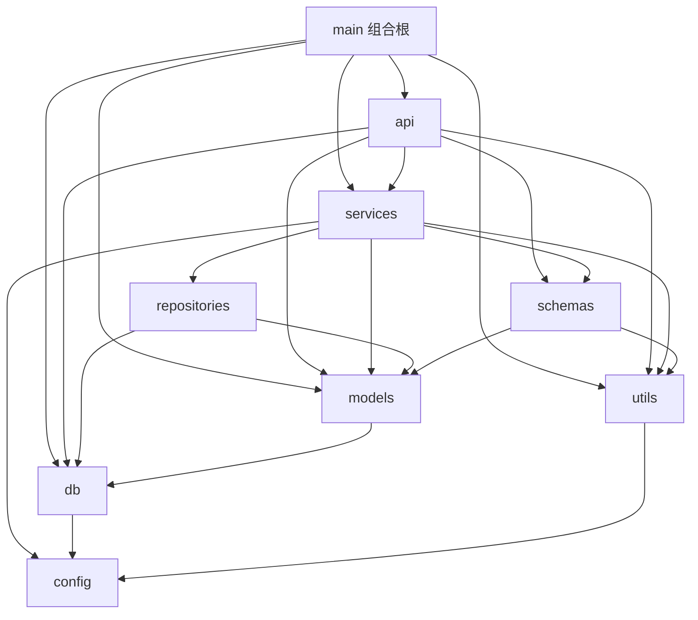
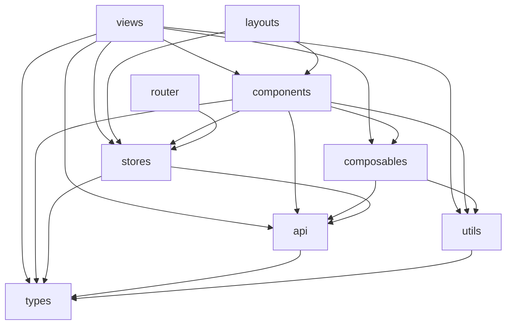

# 模块化架构文档

本文档是 2026-09 模块化重构后的**模块边界权威说明**：每个模块的职责、依赖方向、
接口规范与扩展点。新代码请先读本文再动手；评审时以本文为边界依据。

依赖方向的**机器验证**：`make lint`（或 `cd backend && lint-imports`），
契约声明在 `backend/.importlinter`。本文的依赖图谱与契约一一对应。

---

## 一、后端模块清单（`backend/src/app/`）

| 模块 | 职责（单一职责表述） | 禁止事项 |
|---|---|---|
| `main` | 组合根：应用工厂、异常翻译、中间件与路由装配、探针 | 不含业务规则 |
| `api/v1` | HTTP 适配层：参数声明与校验、响应模型标注、限流挂载、**写路由显式 commit** | 不 import `repositories`；不含查询语义与业务规则 |
| `api`（公共） | `deps`（认证/授权/限流依赖）、`pagination`（PageParams 装配）、`middleware`（请求 ID）、`feed`（RSS/sitemap 直出） | 同上 |
| `services` | 业务规则唯一所在地：可见性判定、状态流转、跨仓储编排、初始化数据（seed） | 不感知 HTTP；不写 SQL |
| `repositories` | 数据访问：筛选/排序/分页 SQL、原子自增、存在性检查 | 不含业务规则；只 flush 不 commit |
| `schemas` | DTO：请求/响应模型、`Page`/`PageParams` 值对象 | 无 IO |
| `models` | ORM 映射与领域枚举 | 不含查询逻辑 |
| `db` | 基础设施：`Base`、会话工厂、事务策略、SQLite 方言类型 | 不依赖 models（seed 已迁至 services） |
| `utils` | 横切工具：异常族、安全、文本、slug、存储、限流、日志 | 必须保持叶子（不依赖任何业务层） |
| `config` | 环境配置（支持 CSV/JSON 双格式的列表字段） | — |

### 依赖图谱（与 `.importlinter` 契约一致）



规则一句话：**箭头只能向下**。`utils` 与 `config` 是底座，任何反向依赖都会被
`lint-imports` 拦下（`app.main` 与 `app.api.feed` 作为组合根/特殊出口不在链条内）。

### 关键设计决策（重构中固化）

1. **写路由显式 commit**（硬约束）：`get_session` 的收尾提交发生在响应发送之后，
   会破坏 read-your-writes。所有写路由末尾必须 `await session.commit()`，
   详见 `db/session.py` docstring 与 `tests/test_write_visibility.py`。
2. **仓储只 flush 不 commit**：一个请求一个事务，服务层组合多仓储不会出现半提交。
3. **事务边界在路由**：服务层不 commit——它是可复用的业务单元（未来 CLI、
   定时任务入口复用同一服务时不应自带事务副作用）。
4. **查询语义归服务层**：「分类可用 slug 或 id 查询」这类规则在
   `ArticleService` / `build_article_filter`，路由只传普通参数。
5. **分页值对象单一来源**：`PageParams`（含 `offset`/`limit`）定义在
   `schemas/common.py`，服务层接收值对象，禁止手算 `(page-1)*size`。

---

## 二、后端模块接口规范

### 2.1 通用约定

- **命名**：服务方法用业务动词（`list_public`/`get_detail`/`ensure_tags`）；
  仓储方法用数据动词（`get_by_slug`/`list_paged`/`slug_exists`）。
- **错误**：服务层抛 `app.utils.exceptions` 的领域异常（`NotFoundError` 等），
  由 `main` 统一翻译成 HTTP（含 `X-Request-ID`）。**仓储不抛领域异常**，
  找不到就返回 `None`，由服务层决定语义。
- **分页**：入参一律 `page_params: PageParams`；返回一律 `Page[T]`（`Page.build`）。

### 2.2 BaseRepository（`repositories/base.py`）

所有仓储的基类，泛型 `BaseRepository[ModelT]`。

```python
# 按主键 / 任一列取单个对象
await repo.get(obj_id)                 # -> ModelT | None
await repo.get_by("slug", value)       # -> ModelT | None

# 存在性检查（"count + where + 排除自己"模式，收敛于此）
await repo.exists(obj_id)              # -> bool
await repo.exists_by("username", value, exclude_id=current_user_id)

# 通用 CRUD（只 flush）
await repo.create(**values)            # -> ModelT（已 flush，有主键）
await repo.update(obj, **values)       # 调用方负责 exclude_unset 过滤
await repo.delete(obj)

await repo.count_all()                 # -> int
```

新增仓储时的检查清单：
- [ ] 继承 `BaseRepository[Model]` 并声明 `model`
- [ ] 唯一性检查用 `exists_by`，不要重写 count 语句
- [ ] 单列查询用 `get_by`，语义化包装（`get_by_slug`）委托即可
- [ ] 复杂查询（JOIN/子查询/窗口）才手写 `select`

### 2.3 服务层（`services/`）

构造约定：`__init__(self, session)` 内部自建仓储；同层服务组合是允许的
（`ArticleService` 组合 `TaxonomyService`），**必须单向**（taxonomy 不反依赖 article）。

使用示例（一个路由的完整委托链）：

```python
@router.get("", response_model=Page[ArticleSummary])
async def list_articles(session: SessionDep, page_params: PageParamsDep, ...) -> Page[ArticleSummary]:
    return await ArticleService(session).list_public(
        page_params=page_params, keyword=keyword, category=category, ...
    )
```

### 2.4 分层契约（`.importlinter`）

```ini
layers = api > services > repositories > schemas > models > db > utils > config
# 另有独立契约：utils 不得依赖任何业务层（叶子约束）
```

---

## 三、前端模块清单（`frontend/src/`）

| 模块 | 职责 | 依赖 |
|---|---|---|
| `api/` | HTTP 客户端：token 管理、401 静默续期、错误归一 `ApiError`、参数清洗。按领域一文件一模块 | `types`（叶子） |
| `types/` | 与后端 Schema 一一对应的类型，按领域拆分（common/user/taxonomy/article/attachment/comment/site），`index.ts` 纯 re-export | 无 |
| `utils/` | 纯函数：markdown 渲染消毒、格式化、状态徽标、分页空页、预取 | `types` |
| `composables/` | 含响应式的可复用交互单元（见下表） | `api`（仅 ApiError/attachmentApi）、`utils` |
| `stores/` | Pinia：auth（会话+用户管理）、site（站点档案）、theme | `api`、`types` |
| `components/` | 可复用展示组件（ConfirmDialog/EmptyState/Pagination/MarkdownEditor…） | `composables`、`stores`、`utils` |
| `layouts/` | 布局壳（Default/Admin/Blank） | `stores`、`components` |
| `views/` | 页面级组件，只做「取数 + 编排 + 模板」 | 一切下层 |
| `router/` | 路由表与守卫 | `stores/auth` |

### Composables 一览（本轮重构后的完整清单）

| composable | 解决的问题 | 关键语义 |
|---|---|---|
| `useAsyncData` | 列表加载三件套（loading/error/data）+ 竞态丢弃 | requestId 丢弃过期响应 |
| `useAction` | 写操作统一错误分流（字段错误/toast/silent） | 并发计数 running；无单飞锁 |
| `useConfirmDelete` | **5 处**删除确认三件套 | request 只开门；confirm 失败保留对话框 |
| `useUpload` | **3 处**单文件上传（校验/提示/计数） | 成功文案注入；`successMessage: false` 供批量汇总 |
| `useTagInput` | 标签键盘交互（回车/逗号/退格/去重/上限） | 标签列表由调用方持有（桥接 computed） |
| `useDraftAutosave` | 本地草稿防丢 | 按 key 分桶、加载完成前禁写、隐私模式静默失效 |
| `useToast` | 全局轻提示 | 模块级单例 ref |
| `useHead` | SEO meta | — |

### 前端依赖图谱



自底向上：`types`（叶子）→ `api` → `stores`/`utils` → `composables` → `components` → `layouts` → `views`。

---

## 四、前端接口规范

### 4.1 API 模块

- 一个领域一个文件（`articles.ts` / `attachments.ts` / `auth.ts` / `comments.ts` /
  `site.ts` / `taxonomy.ts`），**不混装**。
- 查询参数直接传扁平对象，空值清洗由 `api.get` 内的 `cleanParams` 统一处理
  （`undefined`/`null`/`''` 不发送；`0`/`false` 是合法值）。
- 组件统一从 `@/api` 桶导出引入；`ApiError` 的 `status/code/fields` 是错误处理
  的唯一口径。

### 4.2 新写一个后台管理页的标准骨架

```vue
<script setup lang="ts">
// 1. 列表：useAsyncData + emptyPage 初始值
const items = useAsyncData<Page<Item>>(() => itemApi.list(page.value), emptyPage)
// 2. 删除：useConfirmDelete（不要手写 pendingDelete 三件套）
const pendingDelete = useConfirmDelete<Item>({
  remove: (item) => itemApi.remove(item.id),
  success: '已删除',
  onDeleted: () => void items.run(),
})
// 3. 其他写操作：useAction
const action = useAction()
</script>
<template>
  <!-- 模板状态链：skeleton → error → EmptyState → 列表 → Pagination -->
</template>
```

---

## 五、扩展点（如何加东西而不破坏架构）

| 想做的事 | 标准路径 |
|---|---|
| 新增业务域（`friend_links` 就是照这条走的第一例） | 后端：models → schemas → repositories（继承 BaseRepository）→ services → api/v1 路由 + 注册到 `api/v1/__init__.py` + **alembic 迁移**；前端：`types/` 领域文件 → `api/` 模块 → 视图（`@/types`、`@/api` 两个出口要同步导出）。公开读 + 后台写的组合按「`GET /x`（只返回启用项） + `GET /x/manage`（全部）」拆，**别用一个接口兼顾两种视角** |
| 新增列表接口 | 路由声明 `PageParamsDep` → 服务层收 `PageParams` → 仓储 `list_paged`；**禁止手算 offset** |
| 换存储后端（如 S3） | 实现 `utils/storage.py` 的 `StorageBackend` 协议，替换 `storage` 实例——`AttachmentService` 不用改 |
| 换数据库（PostgreSQL） | `db/` 保持方言无关（`db/types.py` 已隔离 SQLite 方言）；模型互引用保持 `TYPE_CHECKING` 守卫 |
| 新增横切中间件 | `api/middleware.py` 或 FastAPI `add_middleware`。**规则是「后注册的在外层」**（实测确认，见 `app/main.py` 的注释）：当前自外向内是 `RequestContext → Head → PublicCache → CORS → 路由`。顺序写错不会报错，只会静默改变行为（例如把 RequestContext 放进内层，被 CORS 拒掉的请求就不会留下任何日志） |
| 新增后台 CRUD 页 | 按 4.2 骨架；删除必用 `useConfirmDelete`，上传必用 `useUpload` |
| 加新的限流入口 | `api/deps.py` 的 `rate_limit(name, limit, window)` 工厂 |
| 让新的公开读接口吃到缓存 | 把路径加进 `api/cache.py` 的 `CACHEABLE_PREFIXES`（自动获得 ETag + `max-age=60` + `Vary: Authorization`，并支持条件请求 304）。后台路径用 `/manage` 或 `/revisions` 命名即可自动排除 |
| 校验用户可控的 URL | 一律用 `utils/url.py::normalize_http_url`（**唯一实现**，评论 / 友链 / 将来的留言板共用）。自己写正则或 `urlsplit` 迟早在某个入口漏掉一种伪协议，而那是存储型 XSS |
| 替换/升级认证 | JWT 逻辑全在 `utils/security.py` + `api/deps.py`，业务层只见 `User` 对象 |
| 改 nginx（加 location、改缓存、改安全头） | 站点内容全在 `deploy/nginx-server.inc`（HTTP 与 HTTPS 两套外壳共用它，改一处两边都生效）。**自己写了 `add_header` 的 location 必须 include `/etc/nginx/conf.d/security-headers.inc`** —— nginx 的 `add_header` 不继承，漏了就是静默丢掉 CSP（首页文档曾经就是这样，见 CHANGELOG）。改完跑 `make deploy-check` |
| 改部署形态（端口、卷、新服务） | `docker-compose.yml` 是默认形态；可选能力（TLS）用覆盖文件（`docker-compose.tls.yml`）而不是往默认文件里塞 —— 默认文件必须保持"克隆下来就能起"。凡是回归脚本需要隔离的路径都做成可覆盖变量（`APP_PORT` / `BACKUP_HOST_DIR` / `CERTBOT_WEBROOT` / `TLS_CERTS_DIR`），验证才不会污染真实数据 |
| 加一个常驻 sidecar（备份、清理…） | 优先复用**已有的镜像**（备份用 `postgres:16-alpine`：`pg_dump` 必须 >= 服务端，同镜像让这条约束天然成立），脚本放 `deploy/` 并用卷挂进容器（改脚本不必重新 build），`restart: unless-stopped` + 循环体自己控节奏。失败要留在日志里而不是让容器退出重启——"一直在重启"比"活着但日志写着失败"更难查 |
| 让一件事在 CI 里被验证 | 优先写成 `tools/*.mjs`，让本地与 CI **跑同一个入口**（`deploy-check` 就是这样：CI 那一步只有一行 `node tools/deploy-check.mjs`），而不是在 workflow 里堆一段只有 CI 才有的 shell。`tools/` 下脚本的约定：只用 Node 内置模块、跨平台、自带清理、退出码 0/1、失败时打印可复现的命令 |

## 六、验证清单（重构完成的判据）

1. `make lint`：ruff + import-linter 分层契约通过（依赖可视化、无循环）。
2. `make check`：格式 + 类型 + 前后端全量测试；**当前基线数字看根目录 `README.md` 的「测试与验证」表**（刻意不在这里写死：文档里的数字必然漂移，一处维护就够）。
3. 写路由保留显式 commit（`test_write_visibility.py` 是它的回归测试）。
4. 新 composable / 新视图必须带 `.spec.ts`（风格见 `useConfirmDelete.spec.ts`、`views/admin/SeriesView.spec.ts`）：**只 spy `@/api` 上的方法，不要 `vi.mock` 业务模块**，并覆盖失败路径与边界。
